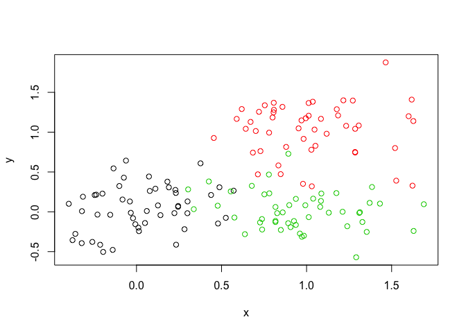

#Unstructured learning: K clustering

```r
# Generate some example data for clustering
tmp <- c(rnorm(30,-3), rnorm(30,3))
x <- cbind(x=tmp, y=rev(tmp))
plot(x)
```

<!-- -->

Our Tasks
Use the kmeans() function setting k to 2 and nstart=20

```r
km <- kmeans(x, centers = 2, nstart = 20)
print(km)
```

```
## K-means clustering with 2 clusters of sizes 30, 30
## 
## Cluster means:
##           x         y
## 1 -3.325987  2.998183
## 2  2.998183 -3.325987
## 
## Clustering vector:
##  [1] 1 1 1 1 1 1 1 1 1 1 1 1 1 1 1 1 1 1 1 1 1 1 1 1 1 1 1 1 1 1 2 2 2 2 2
## [36] 2 2 2 2 2 2 2 2 2 2 2 2 2 2 2 2 2 2 2 2 2 2 2 2 2
## 
## Within cluster sum of squares by cluster:
## [1] 64.17518 64.17518
##  (between_SS / total_SS =  90.3 %)
## 
## Available components:
## 
## [1] "cluster"      "centers"      "totss"        "withinss"    
## [5] "tot.withinss" "betweenss"    "size"         "iter"        
## [9] "ifault"
```


Inspect/print the results
Q. How many points are in each cluster?

```r
km$cluster
```

```
##  [1] 1 1 1 1 1 1 1 1 1 1 1 1 1 1 1 1 1 1 1 1 1 1 1 1 1 1 1 1 1 1 2 2 2 2 2
## [36] 2 2 2 2 2 2 2 2 2 2 2 2 2 2 2 2 2 2 2 2 2 2 2 2 2
```
Q. What ‘component’ of your result object details
- cluster size?

```r
km$size
```

```
## [1] 30 30
```

- cluster assignment/membership?

```r
km$cluster
```

```
##  [1] 1 1 1 1 1 1 1 1 1 1 1 1 1 1 1 1 1 1 1 1 1 1 1 1 1 1 1 1 1 1 2 2 2 2 2
## [36] 2 2 2 2 2 2 2 2 2 2 2 2 2 2 2 2 2 2 2 2 2 2 2 2 2
```

- cluster center?

```r
km$centers
```

```
##           x         y
## 1 -3.325987  2.998183
## 2  2.998183 -3.325987
```
Plot x colored by the kmeans cluster assignment and
add cluster centers as blue points

```r
#Color Coding only the clusters so far
plot(x, col = km$cluster)
#Now we make the centers blue and with a different shape
points(km$centers, col = "blue", pch=15)
```

<!-- -->
Repeat for k=3, which one has the better total SS? 

```r
#Repeat k cluster for k = 3
km2 <- kmeans(x, centers = 3, nstart = 20)
print(km2)
```

```
## K-means clustering with 3 clusters of sizes 30, 14, 16
## 
## Cluster means:
##           x         y
## 1  2.998183 -3.325987
## 2 -3.581086  2.069933
## 3 -3.102776  3.810402
## 
## Clustering vector:
##  [1] 3 3 2 3 3 2 3 3 2 2 3 2 3 3 2 2 2 2 2 2 2 2 3 3 3 3 2 3 3 3 1 1 1 1 1
## [36] 1 1 1 1 1 1 1 1 1 1 1 1 1 1 1 1 1 1 1 1 1 1 1 1 1
## 
## Within cluster sum of squares by cluster:
## [1] 64.17518 12.46151 27.38717
##  (between_SS / total_SS =  92.2 %)
## 
## Available components:
## 
## [1] "cluster"      "centers"      "totss"        "withinss"    
## [5] "tot.withinss" "betweenss"    "size"         "iter"        
## [9] "ifault"
```


```r
plot(x, col = km2$cluster)
points(km2$centers, col = "blue", pch = 15)
```

<!-- -->

#Hierarchial Clustering

Lets try on our X plot

```r
#First we need to calculate point(dis)similarity
#as the euclidean distance between observations
dist_matrix <- dist(x) 
hc <- hclust(d = dist_matrix)

# the print method is not so useful here so we use plot
hc
```

```
## 
## Call:
## hclust(d = dist_matrix)
## 
## Cluster method   : complete 
## Distance         : euclidean 
## Number of objects: 60
```
Lets draw the tree (plot)

```r
#You can choose how many clusters you want and simply move down #  from the top
plot(hc)
abline(h=6, col = "red")
```

<!-- -->

```r
cutree(hc, h=6) # Cut by height h
```

```
##  [1] 1 1 1 1 1 1 1 1 1 1 1 1 1 1 1 1 1 1 1 1 1 1 1 1 1 1 1 1 1 1 2 2 2 2 2
## [36] 2 2 2 2 2 2 2 2 2 2 2 2 2 2 2 2 2 2 2 2 2 2 2 2 2
```

I can 'cut' the tree at any height to give our clustsers...


```r
#cut at height 6
cutree(hc, h = 6)
```

```
##  [1] 1 1 1 1 1 1 1 1 1 1 1 1 1 1 1 1 1 1 1 1 1 1 1 1 1 1 1 1 1 1 2 2 2 2 2
## [36] 2 2 2 2 2 2 2 2 2 2 2 2 2 2 2 2 2 2 2 2 2 2 2 2 2
```

Or ask it to cut yieling 'k' clusters

```r
#give me 4 clusters
cutree(hc, k = 4)
```

```
##  [1] 1 2 2 2 2 2 2 2 2 2 2 2 1 2 2 2 2 2 2 2 2 2 1 2 2 1 2 1 1 2 3 4 4 3 4
## [36] 3 3 4 3 3 3 3 3 3 3 3 3 4 3 3 3 3 3 3 3 3 3 3 3 4
```

Method of clustering matters too!

```r
#You can argue using: complete, single, average, centroid 
#hc.complete <- hclust(d, method="complete")
#hc.average <- hclust(d, method="average")
#hc.single <- hclust(d, method="single")
```


My Turn

```r
# Step 1. Generate some example data for clustering
x <- rbind(
 matrix(rnorm(100, mean=0, sd = 0.3), ncol = 2), # c1
 matrix(rnorm(100, mean = 1, sd = 0.3), ncol = 2), # c2
 matrix(c(rnorm(50, mean = 1, sd = 0.3), # c3
 rnorm(50, mean = 0, sd = 0.3)), ncol = 2))
colnames(x) <- c("x", "y")
# Step 2. Plot the data without clustering
plot(x)
```

<!-- -->

```r
# Step 3. Generate colors for known clusters
# (just so we can compare to hclust results)
col <- as.factor( rep(c("c1","c2","c3"), each=50) )
plot(x, col=col)
```

<!-- -->

Q. Use the dist(), hclust(), plot() and cutree() functions to return 2 and 3 clusters

```r
#ALWAYS NEED TO ADD DIST TO HCLUST
clust <- hclust(dist(x))
plot(clust)
```

<!-- -->


```r
#to produce 2 clusters change out k
members2 <- cutree(clust, k = 2)
members3 <- cutree(clust, k = 3)

#Lets look at both (remember to cbind the new cutree info to be #  able to plot it)
cbind(k2 =members2, k3 = members3)
```

```
##        k2 k3
##   [1,]  1  1
##   [2,]  1  1
##   [3,]  1  1
##   [4,]  1  1
##   [5,]  1  1
##   [6,]  1  1
##   [7,]  1  1
##   [8,]  1  1
##   [9,]  1  1
##  [10,]  1  1
##  [11,]  1  1
##  [12,]  1  2
##  [13,]  1  1
##  [14,]  1  1
##  [15,]  1  2
##  [16,]  1  2
##  [17,]  1  1
##  [18,]  1  1
##  [19,]  1  1
##  [20,]  1  1
##  [21,]  1  1
##  [22,]  1  2
##  [23,]  1  2
##  [24,]  1  2
##  [25,]  1  1
##  [26,]  1  1
##  [27,]  1  1
##  [28,]  1  2
##  [29,]  1  1
##  [30,]  1  1
##  [31,]  1  2
##  [32,]  1  1
##  [33,]  1  1
##  [34,]  1  2
##  [35,]  1  1
##  [36,]  1  1
##  [37,]  1  1
##  [38,]  1  1
##  [39,]  1  1
##  [40,]  1  1
##  [41,]  1  1
##  [42,]  1  2
##  [43,]  1  2
##  [44,]  1  1
##  [45,]  1  1
##  [46,]  1  1
##  [47,]  1  1
##  [48,]  1  1
##  [49,]  1  1
##  [50,]  1  1
##  [51,]  2  3
##  [52,]  2  3
##  [53,]  2  3
##  [54,]  2  3
##  [55,]  1  2
##  [56,]  2  3
##  [57,]  2  3
##  [58,]  1  2
##  [59,]  2  3
##  [60,]  1  2
##  [61,]  2  3
##  [62,]  2  3
##  [63,]  2  3
##  [64,]  2  3
##  [65,]  2  3
##  [66,]  1  2
##  [67,]  1  2
##  [68,]  2  3
##  [69,]  1  2
##  [70,]  2  3
##  [71,]  2  3
##  [72,]  2  3
##  [73,]  2  3
##  [74,]  2  3
##  [75,]  2  3
##  [76,]  2  3
##  [77,]  1  2
##  [78,]  2  3
##  [79,]  1  2
##  [80,]  2  3
##  [81,]  1  2
##  [82,]  2  3
##  [83,]  2  3
##  [84,]  1  2
##  [85,]  2  3
##  [86,]  1  2
##  [87,]  2  3
##  [88,]  2  3
##  [89,]  1  2
##  [90,]  2  3
##  [91,]  1  2
##  [92,]  1  2
##  [93,]  2  3
##  [94,]  1  2
##  [95,]  1  2
##  [96,]  2  3
##  [97,]  2  3
##  [98,]  2  3
##  [99,]  2  3
## [100,]  1  2
## [101,]  1  2
## [102,]  1  2
## [103,]  1  2
## [104,]  1  1
## [105,]  1  2
## [106,]  1  2
## [107,]  1  2
## [108,]  1  2
## [109,]  1  2
## [110,]  1  2
## [111,]  1  2
## [112,]  1  2
## [113,]  1  2
## [114,]  1  2
## [115,]  1  2
## [116,]  1  2
## [117,]  1  2
## [118,]  1  2
## [119,]  1  2
## [120,]  1  2
## [121,]  1  2
## [122,]  1  2
## [123,]  1  2
## [124,]  1  2
## [125,]  1  2
## [126,]  2  3
## [127,]  1  2
## [128,]  1  2
## [129,]  1  2
## [130,]  1  2
## [131,]  1  2
## [132,]  1  2
## [133,]  1  2
## [134,]  1  2
## [135,]  1  2
## [136,]  1  2
## [137,]  1  2
## [138,]  1  2
## [139,]  1  2
## [140,]  1  2
## [141,]  1  2
## [142,]  1  2
## [143,]  1  2
## [144,]  1  2
## [145,]  1  2
## [146,]  1  2
## [147,]  1  2
## [148,]  1  2
## [149,]  1  2
## [150,]  1  2
```

```r
plot(x, col =members3, pch =15)
```

<!-- -->

##How to do PCA in R

#prcomp function in PCA
Making up data

```r
## Initialize a blank 100 row by 10 column matrix
mydata <- matrix(nrow=100, ncol=10)
## Lets label the rows gene1, gene2 etc. to gene100
#Paste makes strings of character values
rownames(mydata) <- paste("gene", 1:100, sep="")
## Lets label the first 5 columns wt1, wt2, wt3, wt4 and wt5
## and the last 5 ko1, ko2 etc. to ko5 (for "knock-out")
colnames(mydata) <- c( paste("wt", 1:5, sep=""),
 paste("ko", 1:5, sep="") )
## Fill in some fake read counts
for(i in 1:nrow(mydata)) {
 wt.values <- rpois(5, lambda=sample(x=10:1000, size=1))
 ko.values <- rpois(5, lambda=sample(x=10:1000, size=1))

 mydata[i,] <- c(wt.values, ko.values)
}
head(mydata)
```

```
##       wt1 wt2 wt3 wt4  wt5 ko1 ko2 ko3 ko4  ko5
## gene1 935 926 957 861  852  14  18  17  12    8
## gene2 961 988 968 982 1016 679 768 714 821  670
## gene3 753 773 731 806  774  28  34  44  26   36
## gene4 355 369 350 364  349 725 778 755 788  730
## gene5 571 536 592 613  587 982 993 918 972 1030
## gene6 423 418 492 434  463 309 292 284 328  279
```

Use prcomp

```r
#prcomp flips data so you need to reflip it again (t = transpose = flips)
#head(t(mydata))
```


```r
pca <- prcomp( t(mydata), scale = TRUE )
pca
```

```
## Standard deviations (1, .., p=10):
##  [1] 9.425201e+00 1.647541e+00 1.444539e+00 1.395975e+00 1.048624e+00
##  [6] 1.019512e+00 9.869443e-01 8.601868e-01 7.501731e-01 3.343359e-15
## 
## Rotation (n x k) = (100 x 10):
##                 PC1           PC2           PC3           PC4
## gene1   -0.10570874 -0.0243138256  0.0003591991 -0.0364187829
## gene2   -0.10064352  0.0009341301  0.0149541233 -0.0878212190
## gene3   -0.10596139 -0.0087546028  0.0111556190  0.0125463212
## gene4    0.10560031 -0.0007883697 -0.0122627544 -0.0063556318
## gene5    0.10489648 -0.0102571630  0.0134732269  0.0548928908
## gene6   -0.10124250 -0.0100009457  0.0521394255 -0.0662316017
## gene7    0.10337209 -0.0026203355 -0.0049969457 -0.0991994395
## gene8   -0.10598970 -0.0241998769  0.0042884527 -0.0045002650
## gene9   -0.10534494 -0.0277823691 -0.0617012143 -0.0172363961
## gene10  -0.05205349  0.1721869546  0.4317598045 -0.0762506425
## gene11   0.07991079 -0.3508521724  0.1427247430 -0.0728913604
## gene12  -0.09808861  0.0108269143  0.1574219578 -0.1382040118
## gene13   0.08030434  0.3322830516  0.0368931732 -0.0235639345
## gene14   0.06900840  0.3755848694  0.1667498365 -0.0806828998
## gene15  -0.09983607  0.1271103532 -0.0279859497  0.1301070209
## gene16   0.09439852  0.0352114821  0.0546831588 -0.0765445906
## gene17  -0.10583923 -0.0283550310 -0.0004580856 -0.0129299443
## gene18   0.09185868 -0.0874081586 -0.2142264193 -0.0403444055
## gene19   0.09433336 -0.1334497485 -0.0759895758  0.1451575139
## gene20   0.09798269  0.0377725879  0.0730970373  0.1352619816
## gene21   0.10303442  0.0284119539  0.0712968327 -0.0298598113
## gene22   0.10439331  0.0477990845  0.0459000909 -0.0369359042
## gene23  -0.10503496 -0.0100523098 -0.0500419708  0.0281012567
## gene24   0.10580678  0.0089932798 -0.0023253530 -0.0263759707
## gene25  -0.10585342  0.0164791244 -0.0012218666  0.0046727690
## gene26   0.10577974  0.0175431904 -0.0237097374 -0.0073792122
## gene27   0.10599181  0.0043486273  0.0056791649 -0.0175514996
## gene28   0.10564221  0.0258810306 -0.0268679967  0.0351588001
## gene29  -0.10146495 -0.0215600073 -0.0995620209  0.1066777889
## gene30   0.10236581  0.1105653042  0.0666339345 -0.0306886348
## gene31  -0.10491876 -0.0010031950  0.0185489535 -0.0897328565
## gene32   0.10594099  0.0146290145 -0.0058719861  0.0094597184
## gene33  -0.08537261  0.0129217569  0.1670991384  0.2714499635
## gene34  -0.10373146  0.0974324474 -0.0052611962  0.0188933548
## gene35  -0.10599426 -0.0193564554  0.0122097702 -0.0058676471
## gene36   0.10588367  0.0155647500 -0.0070702675  0.0024146590
## gene37   0.10582498  0.0003980206 -0.0169394549  0.0266772866
## gene38   0.10170996  0.0528392352 -0.1549955508  0.0661294877
## gene39  -0.10491474 -0.0118053758  0.0837445640  0.0042309079
## gene40  -0.10486475 -0.0014489727 -0.0746676601  0.0065929021
## gene41  -0.10502514 -0.0132057300  0.0222506982  0.0003639662
## gene42   0.08982218 -0.1058686510 -0.0958480596 -0.1426710244
## gene43   0.10105550 -0.0099194958 -0.1002365447 -0.0306519654
## gene44   0.10597117  0.0015726814  0.0016878567  0.0082059311
## gene45  -0.10584727 -0.0274889592 -0.0017845393  0.0071464614
## gene46  -0.10273732  0.1230033849 -0.0235451258 -0.0558755526
## gene47   0.10554234 -0.0335608200  0.0230531850  0.0125446917
## gene48  -0.10331236  0.0240810199  0.0144399535 -0.0375891406
## gene49   0.10593840 -0.0071349276 -0.0231958850  0.0101012396
## gene50   0.10396705 -0.0456383331 -0.0081260593 -0.0220649873
## gene51  -0.10513037 -0.0195556319  0.0236313066 -0.0311897190
## gene52  -0.10579384 -0.0105777633  0.0177809461 -0.0321127765
## gene53   0.10583099  0.0108500728 -0.0171093024  0.0153951303
## gene54  -0.10589254 -0.0047690702 -0.0039105583 -0.0228933627
## gene55  -0.10569100 -0.0060822133  0.0301493961 -0.0365291586
## gene56   0.10424692  0.0458323863  0.0332375771  0.0754842164
## gene57  -0.10586579 -0.0163163820 -0.0084522818  0.0240186138
## gene58  -0.10571531 -0.0020899214  0.0261066528 -0.0282562584
## gene59   0.07119293  0.3040311483  0.1515637400 -0.2597210545
## gene60  -0.10354632 -0.0486746891 -0.0806557354  0.0008720820
## gene61  -0.10549013  0.0062032507 -0.0278128476 -0.0183550147
## gene62   0.09465375  0.0182782412  0.1296260627 -0.1179884950
## gene63   0.10594626  0.0098397192 -0.0086361014  0.0226851728
## gene64  -0.10521921 -0.0454521057  0.0065922934 -0.0462273025
## gene65  -0.10531668  0.0321268763  0.0087352533 -0.0473216687
## gene66   0.10482785  0.0545169941  0.0374412662  0.0492707398
## gene67  -0.09902892  0.0593643996 -0.0609330414  0.1592609775
## gene68  -0.10578085  0.0202098754  0.0180803690 -0.0127467995
## gene69  -0.07740095 -0.0436419480 -0.2124432753  0.1055628039
## gene70   0.10567460 -0.0257939073 -0.0290359372  0.0024704174
## gene71  -0.10065842  0.0692671733  0.0641498995 -0.0282042811
## gene72   0.10529999 -0.0444075128  0.0059466989  0.0186963490
## gene73   0.10594931  0.0074337611  0.0068344796  0.0134942195
## gene74  -0.10503778  0.0127614565 -0.0810231129 -0.0129012907
## gene75   0.10408379 -0.0627011871 -0.0043854352  0.0215266539
## gene76  -0.10072789  0.0809328719 -0.0434770852 -0.0053164378
## gene77   0.10495089  0.0562579012  0.0241770459  0.0458430365
## gene78   0.08196838 -0.0760708184 -0.1694194860  0.1882298859
## gene79   0.10416981  0.0384333244  0.0401895914  0.0612810247
## gene80  -0.04940128  0.3051137872 -0.3688882177 -0.0005460456
## gene81  -0.09954481 -0.0234321057  0.1516804953 -0.0086369058
## gene82  -0.10594076 -0.0194236556 -0.0094083006 -0.0067364003
## gene83  -0.10562375 -0.0059229320  0.0163298859 -0.0430496501
## gene84   0.10576044  0.0292528886  0.0171618175 -0.0238199940
## gene85  -0.10577048 -0.0349944230  0.0025856698  0.0080559115
## gene86  -0.10451708  0.0472987696 -0.0586027286 -0.0349536594
## gene87   0.10558406  0.0163130708  0.0328453958  0.0468120285
## gene88   0.06648854  0.1241603513 -0.0521691621 -0.4539406447
## gene89   0.03021216 -0.4264603268  0.3531380880 -0.1326831472
## gene90  -0.09211630  0.0449921299 -0.1544851428 -0.2658865698
## gene91  -0.10520597 -0.0179624840  0.0067805866 -0.0791591580
## gene92   0.10601316  0.0035743329 -0.0147025058  0.0197634361
## gene93   0.10121402  0.0085154474 -0.0313200390 -0.0002413040
## gene94  -0.10593283 -0.0122245199 -0.0166838815 -0.0032740986
## gene95  -0.10592878 -0.0266471683  0.0082191160  0.0049961146
## gene96  -0.10315051  0.0379530135  0.0076069176  0.0482745754
## gene97   0.10536462  0.0468245855  0.0086485996  0.0101562708
## gene98  -0.10577295 -0.0051359840 -0.0163868092 -0.0372776469
## gene99  -0.04522585  0.2113254764  0.2868761929  0.4983841736
## gene100  0.09943490  0.0125964359 -0.1130323046 -0.0279030917
##                   PC5          PC6           PC7           PC8
## gene1    0.0406924070  0.013185348  0.0186142187 -2.848632e-02
## gene2   -0.2231262032  0.015378817  0.1393393820  1.170530e-01
## gene3    0.0022859143 -0.019336316  0.0080100521  9.938617e-03
## gene4   -0.0655219781 -0.015062394  0.0633661946  1.129334e-02
## gene5    0.0077581856  0.104244419 -0.0302786815  6.081645e-02
## gene6   -0.1374149270  0.179346485 -0.0821250234 -2.926685e-02
## gene7    0.0521781553  0.061367425  0.0843304811  1.475292e-01
## gene8   -0.0053481833  0.004545151  0.0062737651  1.627404e-02
## gene9   -0.0188757963 -0.023793912 -0.0137267003  3.037448e-02
## gene10  -0.1126160821 -0.250628112 -0.2488954980  3.164603e-01
## gene11  -0.0070503755 -0.171282038 -0.0846283542  1.017249e-01
## gene12   0.0409307768  0.171511092 -0.0667463089  1.613967e-01
## gene13   0.2761438407 -0.097195717  0.0959945535  1.596416e-01
## gene14  -0.2066303873  0.192523092  0.0378236965 -9.362278e-02
## gene15  -0.0461921966  0.071279600  0.1032502948 -1.384468e-01
## gene16  -0.0441037141 -0.185695417 -0.2538676308 -2.882982e-01
## gene17   0.0389073197  0.006138518  0.0224931555  1.216055e-02
## gene18  -0.2321696154  0.142663285 -0.1253807603 -2.431720e-02
## gene19   0.0042473483  0.249398488 -0.1107269931  7.045486e-02
## gene20   0.1165177954  0.066998987  0.0380466586 -6.755772e-02
## gene21  -0.0906708168 -0.049387390  0.0475981490 -1.830993e-01
## gene22  -0.0391661392 -0.041076559 -0.0743042226  8.350949e-02
## gene23  -0.0131722410  0.018251893 -0.0249852177  4.897998e-02
## gene24  -0.0284536891 -0.018665451  0.0023839201 -1.862592e-02
## gene25  -0.0402571999  0.005713162 -0.0060627634  4.983322e-02
## gene26  -0.0272829739 -0.004458038  0.0051673071  6.190469e-02
## gene27  -0.0298553847 -0.004027532 -0.0032609192 -1.857198e-02
## gene28   0.0199640833 -0.011630397 -0.0149329026 -6.411745e-03
## gene29   0.1570989941  0.045900411  0.0434501675  6.541946e-02
## gene30   0.0614518470 -0.070276135 -0.0667771421  1.180521e-01
## gene31   0.0227296431 -0.012487404 -0.0620007969  2.488144e-02
## gene32  -0.0021945591 -0.008697751 -0.0379771625 -2.313383e-02
## gene33  -0.2361903606 -0.243262829 -0.0287965115 -1.827995e-01
## gene34   0.0381651122  0.056521300 -0.0689650182  1.025291e-01
## gene35   0.0075157688 -0.007912851  0.0030771836  1.019153e-02
## gene36  -0.0111142589 -0.030830560  0.0130737401  4.314867e-02
## gene37  -0.0022594598 -0.014143658 -0.0536674542  1.362161e-02
## gene38  -0.0170707799 -0.050111059  0.1103072027 -3.913284e-05
## gene39   0.0786096045 -0.016909275  0.0042449222 -6.155726e-03
## gene40  -0.0102717427 -0.073989680 -0.0657793500 -3.727323e-02
## gene41   0.0260329986 -0.048000589 -0.0984224668  2.921798e-02
## gene42   0.1420203522 -0.156601768  0.3838017258  2.812884e-02
## gene43  -0.0681177845  0.001045467  0.2572082448  6.894333e-03
## gene44  -0.0323357536 -0.023347759  0.0150663495  9.365679e-03
## gene45   0.0101689646  0.040657360 -0.0113345463 -2.256300e-02
## gene46  -0.0208354338  0.019445842  0.1005367876 -5.899582e-02
## gene47  -0.0281017922 -0.010297011  0.0165729819 -5.292104e-02
## gene48   0.1725562854  0.039472917  0.1087476110  3.992826e-02
## gene49   0.0201062883 -0.010222132 -0.0265467437  2.066845e-02
## gene50   0.0989387125  0.127026164  0.0355517175 -5.680831e-02
## gene51   0.0822271546 -0.054186483 -0.0192698345 -6.507813e-02
## gene52   0.0414720446  0.019812801  0.0122885921  2.050721e-02
## gene53  -0.0396397616 -0.024448549 -0.0008076470  2.004365e-02
## gene54   0.0247403879 -0.014944925  0.0290728016  1.890307e-03
## gene55   0.0483318223 -0.006779423  0.0162826815  3.592879e-03
## gene56   0.0916714513 -0.004866561 -0.0261663289  8.202869e-02
## gene57   0.0056506994 -0.013694164  0.0453995489 -1.234982e-02
## gene58   0.0251305487  0.006636215 -0.0365537236  5.109006e-02
## gene59  -0.0357770407 -0.075908161  0.2657004720  1.032605e-01
## gene60   0.0965371354  0.014787728 -0.0234807439  1.470662e-01
## gene61  -0.0187659868  0.011804354 -0.0387477735  9.095858e-02
## gene62   0.0731901301  0.109693915 -0.0036188422  2.856154e-01
## gene63   0.0023564221 -0.004917949 -0.0075120768 -4.237101e-02
## gene64   0.0203991274  0.056650898  0.0464628414 -1.982033e-02
## gene65   0.0524883874 -0.047069409 -0.0084883468 -4.561184e-03
## gene66  -0.0135887270  0.071528258  0.0498974318  7.954128e-03
## gene67  -0.0702422719 -0.012338889  0.0810923084 -2.569091e-01
## gene68   0.0030619184 -0.046824167  0.0074324049  3.039942e-03
## gene69  -0.4455713238  0.074797768  0.1562112851  3.651070e-01
## gene70  -0.0266911270 -0.043614581 -0.0267191052 -3.633186e-03
## gene71   0.1855313004  0.130980620 -0.0423541193 -5.127753e-02
## gene72  -0.0637604073 -0.004173131 -0.0147674932  3.441408e-03
## gene73  -0.0071443835  0.020231649 -0.0415922529  7.414842e-03
## gene74   0.0353807390 -0.016615762 -0.0045408300  2.068877e-02
## gene75  -0.0456693963  0.044318623  0.1101764055  1.152526e-01
## gene76   0.1493318997 -0.083308369  0.1215010171 -1.421537e-01
## gene77   0.0548346683  0.021205086 -0.0395317094 -4.803762e-02
## gene78   0.3152415707 -0.140125994 -0.3116532403  2.128676e-01
## gene79   0.0064461348 -0.124243669 -0.0193622171 -6.707741e-02
## gene80  -0.1719048226 -0.430299235 -0.1098896909  1.127825e-01
## gene81  -0.1786909839  0.023429428 -0.0537344645  3.441081e-02
## gene82   0.0201148967  0.013108953 -0.0001531192 -3.105057e-02
## gene83   0.0487129556 -0.020921093  0.0163289354  1.340182e-02
## gene84  -0.0100773437  0.035288521 -0.0220733490 -2.428744e-02
## gene85   0.0165206556  0.020346129  0.0121913555 -4.379466e-02
## gene86   0.0448549453 -0.030714742  0.0719677941  7.248820e-02
## gene87   0.0003955325 -0.013716082 -0.0065252211 -4.748190e-02
## gene88   0.0328625346  0.228253841 -0.2384947643 -2.340413e-01
## gene89  -0.0399246286 -0.241358366  0.2503170305 -6.685980e-02
## gene90  -0.0066827202 -0.187996039  0.0931831587 -9.770594e-02
## gene91   0.0313337971  0.026858967  0.0165431651 -2.791901e-02
## gene92  -0.0059739832 -0.008007224 -0.0018923869  1.601511e-02
## gene93   0.0220710499 -0.252602160 -0.0660406648 -6.346163e-02
## gene94   0.0011550101 -0.001532464 -0.0230206370  4.640990e-02
## gene95  -0.0126685006  0.004446670 -0.0101612621 -3.414456e-04
## gene96   0.1245064549 -0.097035296 -0.0337528163 -1.093448e-01
## gene97  -0.0171832476  0.047847848  0.0478130137 -3.709603e-02
## gene98   0.0342956037 -0.030830239 -0.0164022607 -2.257435e-03
## gene99   0.0674384759  0.081516626  0.1710831618 -8.518125e-03
## gene100  0.1883515273 -0.037572432  0.2157349354  4.733820e-02
##                   PC9          PC10
## gene1    1.909808e-02 -1.579874e-02
## gene2   -3.389866e-02 -7.930395e-03
## gene3   -4.767629e-02  1.154207e-01
## gene4    4.872127e-03  1.414553e-01
## gene5   -4.222557e-02  4.500236e-02
## gene6    1.551758e-01  3.785037e-02
## gene7   -5.243532e-02  3.607712e-02
## gene8   -1.304632e-02  7.839594e-02
## gene9   -5.480805e-02 -9.556811e-03
## gene10   3.393793e-01  1.063143e-01
## gene11  -3.129504e-02 -1.731805e-01
## gene12  -3.794972e-03 -3.191051e-01
## gene13  -5.958936e-02  5.030708e-01
## gene14  -2.308570e-01  1.051907e-02
## gene15   8.317519e-02  2.383513e-02
## gene16  -2.112320e-01 -3.368134e-02
## gene17  -1.093942e-02  6.863797e-02
## gene18   2.478206e-01  8.145647e-02
## gene19   2.220403e-01  1.706908e-01
## gene20   3.578817e-01  6.001345e-02
## gene21  -8.218995e-02  4.191664e-02
## gene22  -9.090692e-02  7.435103e-02
## gene23   1.332326e-01 -3.792820e-02
## gene24   6.518215e-02  1.595687e-02
## gene25   1.593900e-02  4.069413e-02
## gene26  -1.813623e-02 -3.196904e-02
## gene27  -7.197132e-03  9.670033e-03
## gene28   5.996363e-02 -4.197616e-02
## gene29   1.113728e-01  7.963791e-02
## gene30  -4.002197e-02  3.019494e-02
## gene31   3.701498e-02  2.364051e-03
## gene32   2.130960e-02 -3.102445e-02
## gene33   5.712004e-02  1.333465e-01
## gene34   2.182041e-02  1.819356e-02
## gene35  -2.515988e-02  1.630439e-02
## gene36  -3.278843e-02 -5.682075e-02
## gene37   3.684361e-03  4.610228e-02
## gene38  -2.059128e-03 -2.230866e-01
## gene39  -3.045607e-03  1.064466e-02
## gene40  -2.489886e-02 -1.333203e-02
## gene41  -9.811509e-02  9.523735e-02
## gene42   6.370803e-02 -3.972481e-02
## gene43  -1.695379e-02  9.656607e-02
## gene44   2.121116e-02 -2.466898e-02
## gene45   2.064419e-02 -1.045500e-02
## gene46   3.665739e-02 -3.798281e-02
## gene47   6.882371e-02  2.720175e-02
## gene48  -3.819435e-03  3.493482e-02
## gene49   1.296308e-03 -4.805961e-02
## gene50   5.781554e-02  3.733844e-05
## gene51   1.235685e-02  1.258637e-02
## gene52   2.930220e-03  7.696292e-03
## gene53   4.210510e-02  3.807131e-02
## gene54  -4.284778e-02  2.717399e-03
## gene55  -1.816026e-02  7.216855e-03
## gene56  -3.202634e-02  3.148402e-02
## gene57  -7.994299e-03 -1.821475e-02
## gene58   2.098806e-02 -3.858346e-02
## gene59   2.508260e-01 -6.034602e-02
## gene60  -3.007701e-02  1.390943e-01
## gene61   4.096420e-02 -4.133054e-02
## gene62  -3.325481e-01 -1.827179e-01
## gene63  -7.585983e-03  2.760579e-02
## gene64  -2.850770e-02  9.305098e-02
## gene65  -5.873256e-02  3.603604e-02
## gene66  -1.286082e-02  1.205455e-01
## gene67  -4.728028e-02  1.468369e-01
## gene68  -5.200987e-02 -2.618358e-02
## gene69   1.933545e-02  1.126319e-02
## gene70  -4.070845e-02  7.237869e-02
## gene71   1.757521e-01 -7.691118e-02
## gene72  -8.617147e-02  4.331995e-02
## gene73   1.557903e-03 -4.438691e-02
## gene74   7.807421e-02  1.391728e-02
## gene75  -5.351711e-03 -2.124131e-02
## gene76   1.677213e-01 -1.994855e-01
## gene77   3.284046e-02 -1.733378e-02
## gene78  -3.449977e-02 -6.750598e-03
## gene79   5.237460e-02  1.846193e-02
## gene80   2.760708e-02 -1.420250e-01
## gene81  -2.336039e-01  1.376380e-01
## gene82  -2.449800e-02  2.490951e-03
## gene83  -4.636439e-02 -1.913556e-02
## gene84  -2.272587e-03 -3.622878e-02
## gene85  -2.717254e-02  5.247372e-02
## gene86   5.723016e-02  3.720852e-02
## gene87  -3.055065e-02  5.363957e-02
## gene88   1.109467e-01 -1.382473e-02
## gene89   8.512486e-02  1.043481e-01
## gene90  -3.851406e-02 -4.358868e-02
## gene91   3.996273e-02  5.550937e-04
## gene92   1.054319e-02 -3.740213e-02
## gene93   1.556026e-01 -1.612632e-01
## gene94   1.495662e-05 -2.245533e-02
## gene95  -3.729126e-02  8.596916e-02
## gene96  -1.295028e-01  7.098642e-02
## gene97   5.212299e-02 -5.396265e-02
## gene98  -2.069190e-02 -2.415584e-02
## gene99  -3.851574e-02 -3.436567e-01
## gene100 -9.966221e-02  4.722574e-02
```


```r
## A basic PC1 vs PC2 plot 2-D
attributes(pca)
```

```
## $names
## [1] "sdev"     "rotation" "center"   "scale"    "x"       
## 
## $class
## [1] "prcomp"
```

```r
#x is  the name for our data so we use that in our PCA analysis
plot(pca$x[,1], pca$x[,2])
```

<!-- -->

How well are our PC's capturing our data spread (i.e. variance)


```r
##percent variance is often more informative to look at
pca.var <- pca$sdev^2
pca.var.per <- round(pca.var/sum(pca.var)*100, 1)

pca.var.per
```

```
##  [1] 88.8  2.7  2.1  1.9  1.1  1.0  1.0  0.7  0.6  0.0
```

plot our scree plot


```r
barplot(pca.var.per, main="Scree Plot",
 xlab="Principal Component", ylab="Percent Variation")
```

<!-- -->


```r
#color up our PCA plot
colvec <- colnames(mydata)
colvec[grep("wt", colvec)] <- "red"
colvec[grep("ko", colvec)] <- "blue"
plot(pca$x[,1], pca$x[,2], col=colvec, pch=16,
 xlab=paste0("PC1 (", pca.var.per[1], "%)"),
 ylab=paste0("PC2 (", pca.var.per[2], "%)")) 
```

<!-- -->

Add some labels to points

```r
plot(pca$x[,1], pca$x[,2], col=colvec, pch=16,
 xlab=paste0("PC1 (", pca.var.per[1], "%)"),
 ylab=paste0("PC2 (", pca.var.per[2], "%)")) 
identify(pca$x[,1], pca$x[,2], labels=colnames(mydata))
```

<!-- -->

```
## integer(0)
```

Loading scores

```r
loading_scores <- pca$rotation[,1]
summary(loading_scores)
```

```
##     Min.  1st Qu.   Median     Mean  3rd Qu.     Max. 
## -0.10599 -0.10506 -0.05073 -0.00491  0.10419  0.10601
```

```r
## We are interested in the magnitudes of both plus
## and minus contributing genes
gene_scores <- abs(loading_scores) 
```

UK Foods Hands On

```r
x <- read.csv("~/Downloads/UK_foods.csv")
dim(x)
```

```
## [1] 17  5
```


