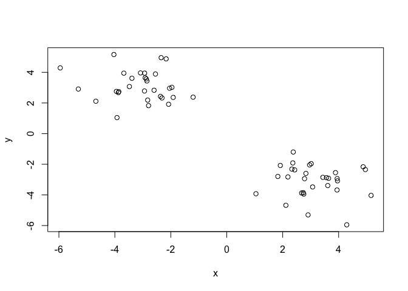
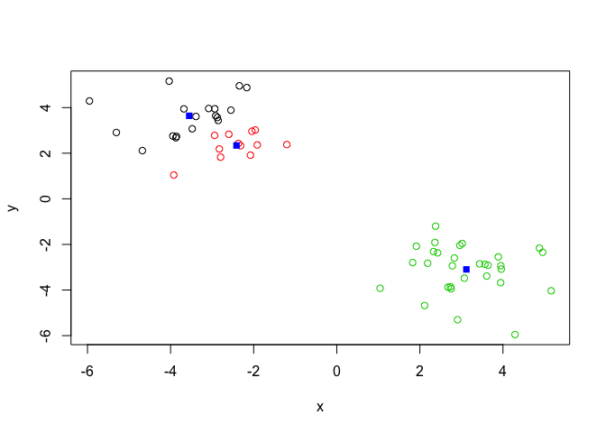
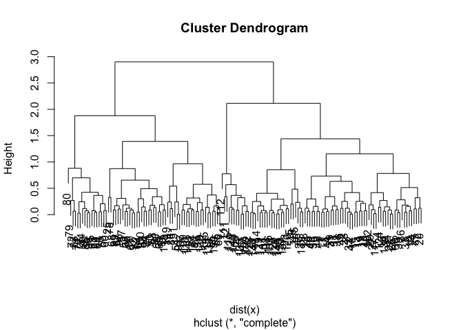
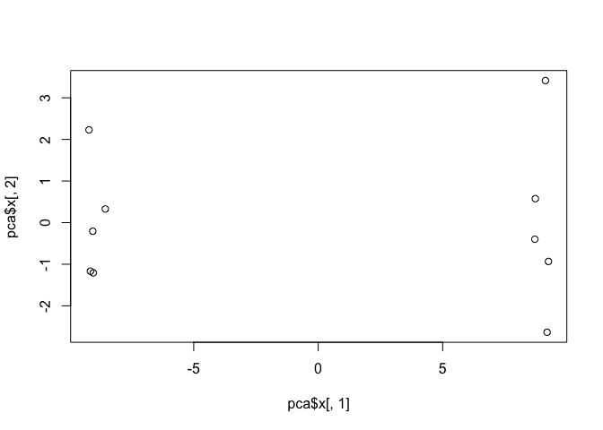

#Unstructured learning: K clustering

```r
# Generate some example data for clustering
tmp <- c(rnorm(30,-3), rnorm(30,3))
x <- cbind(x=tmp, y=rev(tmp))
plot(x)
```

<!-- -->

Our Tasks
Use the kmeans() function setting k to 2 and nstart=20

```r
km <- kmeans(x, centers = 2, nstart = 20)
print(km)
```

```
## K-means clustering with 2 clusters of sizes 30, 30
## 
## Cluster means:
##           x         y
## 1 -2.709180  2.968925
## 2  2.968925 -2.709180
## 
## Clustering vector:
##  [1] 1 1 1 1 1 1 1 1 1 1 1 1 1 1 1 1 1 1 1 1 1 1 1 1 1 1 1 1 1 1 2 2 2 2 2
## [36] 2 2 2 2 2 2 2 2 2 2 2 2 2 2 2 2 2 2 2 2 2 2 2 2 2
## 
## Within cluster sum of squares by cluster:
## [1] 39.91191 39.91191
##  (between_SS / total_SS =  92.4 %)
## 
## Available components:
## 
## [1] "cluster"      "centers"      "totss"        "withinss"    
## [5] "tot.withinss" "betweenss"    "size"         "iter"        
## [9] "ifault"
```


Inspect/print the results
Q. How many points are in each cluster?

```r
km$cluster
```

```
##  [1] 1 1 1 1 1 1 1 1 1 1 1 1 1 1 1 1 1 1 1 1 1 1 1 1 1 1 1 1 1 1 2 2 2 2 2
## [36] 2 2 2 2 2 2 2 2 2 2 2 2 2 2 2 2 2 2 2 2 2 2 2 2 2
```
Q. What ‘component’ of your result object details
- cluster size?

```r
km$size
```

```
## [1] 30 30
```

- cluster assignment/membership?

```r
km$cluster
```

```
##  [1] 1 1 1 1 1 1 1 1 1 1 1 1 1 1 1 1 1 1 1 1 1 1 1 1 1 1 1 1 1 1 2 2 2 2 2
## [36] 2 2 2 2 2 2 2 2 2 2 2 2 2 2 2 2 2 2 2 2 2 2 2 2 2
```

- cluster center?

```r
km$centers
```

```
##           x         y
## 1 -2.709180  2.968925
## 2  2.968925 -2.709180
```
Plot x colored by the kmeans cluster assignment and
add cluster centers as blue points

```r
#Color Coding only the clusters so far
plot(x, col = km$cluster)
#Now we make the centers blue and with a different shape
points(km$centers, col = "blue", pch=15)
```

<!-- -->
Repeat for k=3, which one has the better total SS? 

```r
#Repeat k cluster for k = 3
km2 <- kmeans(x, centers = 3, nstart = 20)
print(km2)
```

```
## K-means clustering with 3 clusters of sizes 30, 16, 14
## 
## Cluster means:
##           x         y
## 1 -2.709180  2.968925
## 2  3.197692 -3.351144
## 3  2.707478 -1.975507
## 
## Clustering vector:
##  [1] 1 1 1 1 1 1 1 1 1 1 1 1 1 1 1 1 1 1 1 1 1 1 1 1 1 1 1 1 1 1 2 2 3 3 2
## [36] 3 3 3 3 2 2 2 3 2 3 3 2 3 2 2 2 3 2 3 2 2 3 2 2 3
## 
## Within cluster sum of squares by cluster:
## [1] 39.91191 11.02770 12.96017
##  (between_SS / total_SS =  93.9 %)
## 
## Available components:
## 
## [1] "cluster"      "centers"      "totss"        "withinss"    
## [5] "tot.withinss" "betweenss"    "size"         "iter"        
## [9] "ifault"
```


```r
plot(x, col = km2$cluster)
points(km2$centers, col = "blue", pch = 15)
```

<!-- -->

#Hierarchial Clustering

Lets try on our X plot

```r
#First we need to calculate point(dis)similarity
#as the euclidean distance between observations
dist_matrix <- dist(x) 
hc <- hclust(d = dist_matrix)

# the print method is not so useful here so we use plot
hc
```

```
## 
## Call:
## hclust(d = dist_matrix)
## 
## Cluster method   : complete 
## Distance         : euclidean 
## Number of objects: 60
```
Lets draw the tree (plot)

```r
#You can choose how many clusters you want and simply move down #  from the top
plot(hc)
abline(h=6, col = "red")
```

<!-- -->

```r
cutree(hc, h=6) # Cut by height h
```

```
##  [1] 1 1 1 1 1 1 1 1 1 1 1 1 1 1 1 1 1 1 1 1 1 1 1 1 1 1 1 1 1 1 2 2 2 2 2
## [36] 2 2 2 2 2 2 2 2 2 2 2 2 2 2 2 2 2 2 2 2 2 2 2 2 2
```

I can 'cut' the tree at any height to give our clustsers...


```r
#cut at height 6
cutree(hc, h = 6)
```

```
##  [1] 1 1 1 1 1 1 1 1 1 1 1 1 1 1 1 1 1 1 1 1 1 1 1 1 1 1 1 1 1 1 2 2 2 2 2
## [36] 2 2 2 2 2 2 2 2 2 2 2 2 2 2 2 2 2 2 2 2 2 2 2 2 2
```

Or ask it to cut yieling 'k' clusters

```r
#give me 4 clusters
cutree(hc, k = 4)
```

```
##  [1] 1 1 1 2 1 1 2 1 2 1 1 1 2 1 2 2 1 2 1 1 1 2 2 2 2 1 2 2 1 1 3 3 4 4 3
## [36] 4 4 4 4 3 3 3 4 3 4 4 3 4 3 3 3 4 3 4 3 3 4 3 3 3
```

Method of clustering matters too!

```r
#You can argue using: complete, single, average, centroid 
#hc.complete <- hclust(d, method="complete")
#hc.average <- hclust(d, method="average")
#hc.single <- hclust(d, method="single")
```


My Turn

```r
# Step 1. Generate some example data for clustering
x <- rbind(
 matrix(rnorm(100, mean=0, sd = 0.3), ncol = 2), # c1
 matrix(rnorm(100, mean = 1, sd = 0.3), ncol = 2), # c2
 matrix(c(rnorm(50, mean = 1, sd = 0.3), # c3
 rnorm(50, mean = 0, sd = 0.3)), ncol = 2))
colnames(x) <- c("x", "y")
# Step 2. Plot the data without clustering
plot(x)
```

<!-- -->

```r
# Step 3. Generate colors for known clusters
# (just so we can compare to hclust results)
col <- as.factor( rep(c("c1","c2","c3"), each=50) )
plot(x, col=col)
```

<!-- -->

Q. Use the dist(), hclust(), plot() and cutree() functions to return 2 and 3 clusters

```r
#ALWAYS NEED TO ADD DIST TO HCLUST
clust <- hclust(dist(x))
plot(clust)
```

<!-- -->


```r
#to produce 2 clusters change out k
members2 <- cutree(clust, k = 2)
members3 <- cutree(clust, k = 3)

#Lets look at both (remember to cbind the new cutree info to be #  able to plot it)
cbind(k2 =members2, k3 = members3)
```

```
##        k2 k3
##   [1,]  1  1
##   [2,]  1  1
##   [3,]  1  1
##   [4,]  1  1
##   [5,]  1  1
##   [6,]  1  1
##   [7,]  1  1
##   [8,]  1  1
##   [9,]  1  1
##  [10,]  1  1
##  [11,]  1  1
##  [12,]  1  1
##  [13,]  1  1
##  [14,]  1  1
##  [15,]  1  1
##  [16,]  1  1
##  [17,]  1  1
##  [18,]  1  1
##  [19,]  1  1
##  [20,]  1  1
##  [21,]  1  1
##  [22,]  1  1
##  [23,]  2  2
##  [24,]  1  1
##  [25,]  1  1
##  [26,]  1  1
##  [27,]  1  1
##  [28,]  1  1
##  [29,]  1  1
##  [30,]  1  1
##  [31,]  1  1
##  [32,]  1  1
##  [33,]  2  2
##  [34,]  1  1
##  [35,]  1  1
##  [36,]  1  1
##  [37,]  1  1
##  [38,]  1  1
##  [39,]  1  1
##  [40,]  1  1
##  [41,]  1  3
##  [42,]  1  1
##  [43,]  1  1
##  [44,]  1  1
##  [45,]  1  3
##  [46,]  1  1
##  [47,]  1  3
##  [48,]  1  1
##  [49,]  1  1
##  [50,]  1  1
##  [51,]  2  2
##  [52,]  2  2
##  [53,]  2  2
##  [54,]  2  2
##  [55,]  2  2
##  [56,]  2  2
##  [57,]  2  2
##  [58,]  2  2
##  [59,]  2  2
##  [60,]  1  3
##  [61,]  2  2
##  [62,]  1  3
##  [63,]  2  2
##  [64,]  2  2
##  [65,]  2  2
##  [66,]  1  3
##  [67,]  2  2
##  [68,]  2  2
##  [69,]  2  2
##  [70,]  2  2
##  [71,]  2  2
##  [72,]  2  2
##  [73,]  2  2
##  [74,]  2  2
##  [75,]  2  2
##  [76,]  2  2
##  [77,]  2  2
##  [78,]  1  3
##  [79,]  1  3
##  [80,]  2  2
##  [81,]  2  2
##  [82,]  2  2
##  [83,]  2  2
##  [84,]  2  2
##  [85,]  2  2
##  [86,]  2  2
##  [87,]  2  2
##  [88,]  2  2
##  [89,]  2  2
##  [90,]  1  3
##  [91,]  2  2
##  [92,]  2  2
##  [93,]  2  2
##  [94,]  2  2
##  [95,]  2  2
##  [96,]  2  2
##  [97,]  2  2
##  [98,]  2  2
##  [99,]  2  2
## [100,]  2  2
## [101,]  1  1
## [102,]  1  3
## [103,]  1  3
## [104,]  1  3
## [105,]  1  3
## [106,]  1  3
## [107,]  1  3
## [108,]  1  3
## [109,]  1  3
## [110,]  1  3
## [111,]  1  3
## [112,]  1  3
## [113,]  1  3
## [114,]  1  3
## [115,]  1  3
## [116,]  1  3
## [117,]  1  3
## [118,]  1  3
## [119,]  1  3
## [120,]  1  1
## [121,]  1  3
## [122,]  1  3
## [123,]  1  3
## [124,]  1  1
## [125,]  1  3
## [126,]  1  3
## [127,]  1  3
## [128,]  1  3
## [129,]  1  3
## [130,]  1  3
## [131,]  1  3
## [132,]  1  3
## [133,]  1  3
## [134,]  1  3
## [135,]  1  3
## [136,]  1  3
## [137,]  1  3
## [138,]  1  3
## [139,]  1  3
## [140,]  1  1
## [141,]  1  1
## [142,]  1  3
## [143,]  1  1
## [144,]  1  3
## [145,]  1  3
## [146,]  1  3
## [147,]  1  3
## [148,]  1  3
## [149,]  1  3
## [150,]  1  3
```

```r
plot(x, col =members3, pch =15)
```

<!-- -->

##How to do PCA in R

#prcomp function in PCA
Making up data

```r
## Initialize a blank 100 row by 10 column matrix
mydata <- matrix(nrow=100, ncol=10)
## Lets label the rows gene1, gene2 etc. to gene100
#Paste makes strings of character values
rownames(mydata) <- paste("gene", 1:100, sep="")
## Lets label the first 5 columns wt1, wt2, wt3, wt4 and wt5
## and the last 5 ko1, ko2 etc. to ko5 (for "knock-out")
colnames(mydata) <- c( paste("wt", 1:5, sep=""),
 paste("ko", 1:5, sep="") )
## Fill in some fake read counts
for(i in 1:nrow(mydata)) {
 wt.values <- rpois(5, lambda=sample(x=10:1000, size=1))
 ko.values <- rpois(5, lambda=sample(x=10:1000, size=1))

 mydata[i,] <- c(wt.values, ko.values)
}
head(mydata)
```

```
##       wt1 wt2 wt3 wt4 wt5 ko1 ko2 ko3 ko4 ko5
## gene1 449 468 462 459 499 733 691 692 645 668
## gene2 581 554 572 551 552 981 928 952 971 967
## gene3 169 146 147 149 125 771 741 776 765 767
## gene4 221 200 205 189 216 638 615 611 572 606
## gene5 596 586 593 658 616 587 591 588 569 622
## gene6 252 231 224 206 240 255 240 236 253 234
```

Use prcomp

```r
#prcomp flips data so you need to reflip it again (t = transpose = flips)
#head(t(mydata))
```


```r
pca <- prcomp( t(mydata), scale = TRUE )
pca
```

```
## Standard deviations (1, .., p=10):
##  [1] 9.433887e+00 1.864519e+00 1.477293e+00 1.372395e+00 1.033244e+00
##  [6] 9.341200e-01 8.737398e-01 6.787436e-01 5.433196e-01 3.054399e-15
## 
## Rotation (n x k) = (100 x 10):
##                 PC1           PC2           PC3           PC4
## gene1    0.10328045 -0.0332904932 -0.0280462913 -4.164496e-02
## gene2    0.10568749 -0.0073066879 -0.0141381311 -1.781610e-02
## gene3    0.10587813 -0.0101615725 -0.0164287642  5.471628e-03
## gene4    0.10546357 -0.0137917189 -0.0347197302 -2.371527e-02
## gene5   -0.04323566 -0.4651554546 -0.0035299746  1.659519e-02
## gene6    0.05047286  0.2686072682  0.1757025715 -2.807085e-01
## gene7   -0.09907452  0.1267193279  0.0142075781 -8.574766e-02
## gene8   -0.10309594  0.0396442754 -0.0705825040  8.543860e-02
## gene9    0.10410790  0.0188144472  0.0862733813 -2.286908e-02
## gene10   0.01660981 -0.3585300012  0.4369449295 -9.234190e-02
## gene11   0.10575281  0.0012612550  0.0071359093  2.501987e-02
## gene12   0.10531310 -0.0097360570  0.0194791355 -4.507832e-02
## gene13  -0.10562120  0.0163497387  0.0315510744  3.049291e-02
## gene14  -0.10014756 -0.0534995175 -0.0349797716  9.891268e-03
## gene15  -0.10569226 -0.0095663056  0.0174883354 -1.832312e-02
## gene16  -0.10463560  0.0200815175  0.0068153839 -6.087767e-02
## gene17  -0.10170145 -0.0606211872 -0.0502610237 -4.181318e-02
## gene18   0.10587241 -0.0104607527 -0.0010936920  1.297459e-02
## gene19  -0.10578542  0.0105844439  0.0182338917  3.608842e-02
## gene20  -0.10584062  0.0101658310  0.0011574849  1.431066e-02
## gene21  -0.10451599 -0.0040615411 -0.0497128954 -8.005284e-02
## gene22  -0.09550804  0.0037594558  0.0485594754 -2.643256e-02
## gene23  -0.10537695  0.0234403885  0.0548104794 -3.456146e-03
## gene24  -0.09797752  0.0750014125  0.0790728862 -1.440726e-01
## gene25  -0.04781478  0.0714667304 -0.3820196354 -4.563325e-01
## gene26  -0.10465855 -0.0193322653  0.0841775322  3.762320e-02
## gene27   0.10575545 -0.0284403307  0.0131151715 -1.465963e-03
## gene28   0.10438063 -0.0755130410  0.0376428387 -2.617108e-02
## gene29   0.10445926  0.0062776054 -0.0627570833 -1.601274e-02
## gene30   0.08345093  0.1825280359  0.2069054660  1.062267e-02
## gene31   0.10586590 -0.0001274330  0.0089950376  1.532210e-03
## gene32   0.10562718 -0.0048022973 -0.0132873299  1.150947e-02
## gene33  -0.10186466 -0.0487850927  0.1404471677 -5.105540e-02
## gene34   0.09995250  0.0698467856 -0.0388259870 -1.447771e-02
## gene35  -0.10569303 -0.0051403893  0.0154340113  2.592959e-02
## gene36  -0.10463976 -0.0014241846 -0.0146608128 -5.957426e-02
## gene37   0.10482940 -0.0147981467 -0.0441337512 -1.271614e-02
## gene38   0.10526278  0.0058910855  0.0211345263  3.337357e-04
## gene39  -0.10485285  0.0026224446 -0.0548782508  2.521114e-02
## gene40   0.10586390 -0.0148013492 -0.0131860610 -9.132053e-03
## gene41  -0.07668761 -0.1729739538  0.1288941253 -1.718369e-01
## gene42  -0.10571884 -0.0009074472  0.0216321826 -1.606635e-02
## gene43   0.08416064  0.1021886695  0.3191067626  1.293147e-01
## gene44  -0.03052599  0.3004916416  0.0463366931 -4.665050e-01
## gene45   0.10360980  0.0162577356 -0.0425695369 -6.347324e-02
## gene46   0.10325732 -0.0071604920 -0.0241245383  1.454848e-01
## gene47  -0.10577256  0.0038649355 -0.0067059913  2.582760e-02
## gene48   0.10577275 -0.0239947219 -0.0220675056 -6.740635e-03
## gene49   0.10526839 -0.0157884775  0.0072934955 -5.276691e-02
## gene50   0.10575577 -0.0259547924  0.0043524714 -1.121433e-02
## gene51   0.10574384 -0.0088488364  0.0020369273 -1.404495e-02
## gene52  -0.10555230  0.0360327143  0.0015032458 -1.960812e-02
## gene53   0.10473872  0.0523427614 -0.0027319739  1.759347e-02
## gene54  -0.10547375  0.0196666931  0.0067571761  3.061446e-02
## gene55  -0.10565374  0.0231597992  0.0087847777  2.385579e-02
## gene56  -0.10587071  0.0120841257 -0.0009104769 -2.101772e-02
## gene57  -0.07930604 -0.1751517693 -0.3190441735 -7.249314e-02
## gene58  -0.10566821  0.0122892817  0.0074462772  1.884029e-02
## gene59  -0.10461850  0.0268546511  0.0304362742  1.350446e-02
## gene60  -0.10564742  0.0356541947 -0.0004325803 -1.612008e-02
## gene61  -0.10567406  0.0228664369  0.0169562954 -1.804835e-02
## gene62  -0.10000694 -0.0713141868  0.0763250485  1.158244e-01
## gene63  -0.03167895 -0.2729858787  0.2340362870 -4.724343e-01
## gene64   0.10512470 -0.0283282975 -0.0299140276  4.178250e-03
## gene65   0.10590573 -0.0170767160 -0.0080255461  1.698212e-04
## gene66  -0.10557561  0.0204929950 -0.0120651483  4.648570e-02
## gene67   0.10594652  0.0018518772  0.0095861740 -3.694682e-03
## gene68   0.10517311  0.0129078017  0.0012989913 -1.619722e-02
## gene69   0.10371338 -0.0375575284  0.0108946926 -4.160498e-02
## gene70   0.10563392  0.0069556812 -0.0220971163  1.235536e-02
## gene71   0.09836226  0.1055827860 -0.0230760691 -1.218631e-01
## gene72  -0.10557897  0.0426767735  0.0053054430  1.088193e-02
## gene73  -0.10317316 -0.0828758884  0.0166729542  7.988020e-02
## gene74   0.10569755  0.0062234066 -0.0038176670  9.493237e-03
## gene75  -0.10541058  0.0369869819 -0.0109246892 -4.645390e-02
## gene76   0.10566397 -0.0080021733 -0.0083221636  2.991876e-02
## gene77   0.10548062 -0.0215509286 -0.0300271194 -6.212060e-03
## gene78   0.10543303 -0.0093573070 -0.0374098236  1.178443e-02
## gene79   0.10548996  0.0117650240  0.0026178128  1.412640e-02
## gene80  -0.10552518  0.0158149663 -0.0225437321  5.042773e-02
## gene81  -0.10561379  0.0189003284  0.0333801058  6.660991e-03
## gene82   0.10186376 -0.0691796923 -0.1176306360 -9.440934e-02
## gene83   0.09539342 -0.1674336961  0.0158758549 -1.088850e-01
## gene84   0.09978414 -0.0633646717 -0.1069104813  7.308523e-02
## gene85  -0.10582973  0.0268989946  0.0009241430  4.135760e-03
## gene86   0.10551234  0.0114797681  0.0124060982 -2.393122e-05
## gene87   0.09961469 -0.0256191408 -0.1329125898 -7.272428e-02
## gene88  -0.10587540  0.0139816330  0.0225167159  6.874424e-03
## gene89  -0.10561826  0.0087987504  0.0271769599  4.908062e-02
## gene90   0.09761200 -0.1681678659  0.0513064090 -1.853779e-02
## gene91  -0.10054141 -0.0785364743  0.1454511376 -6.814941e-03
## gene92   0.10186329 -0.0612326730  0.0593269718 -9.486904e-02
## gene93   0.10544678 -0.0312661923 -0.0377212685 -1.863503e-02
## gene94  -0.10511156 -0.0050342709  0.0460489460 -2.845828e-02
## gene95  -0.10519356 -0.0041043590  0.0017099984  3.560721e-02
## gene96  -0.10533477  0.0288426061 -0.0345186787  1.611242e-02
## gene97  -0.05564464 -0.3642980122 -0.2714861801 -1.087547e-01
## gene98  -0.08887958  0.0078040281 -0.2603371458  8.611136e-02
## gene99  -0.09446292 -0.0891390741  0.0378553494 -8.622530e-03
## gene100 -0.10547925  0.0259222019  0.0099709049 -3.081181e-02
##                   PC5           PC6          PC7           PC8
## gene1    0.0396548858 -0.0792912303  0.074354683 -0.1871105977
## gene2   -0.0247350015  0.0135686036  0.057091834 -0.0062992126
## gene3   -0.0056363153 -0.0037200299  0.013295205 -0.0160777828
## gene4    0.0324201244 -0.0506550570  0.039713607 -0.0493379431
## gene5   -0.0154270882 -0.1286869981 -0.255388050 -0.0006881679
## gene6    0.2653884808 -0.0367524154  0.525346681 -0.0404066888
## gene7   -0.1653992832  0.0598215913  0.087743542  0.1926525698
## gene8    0.1258637929 -0.0513157364 -0.042177433 -0.0419783657
## gene9    0.0560040983  0.0720598145 -0.050804844  0.1030758231
## gene10  -0.2787428279  0.0249834859 -0.037534484 -0.1296650062
## gene11   0.0218811003 -0.0302084358 -0.025949099 -0.0581282549
## gene12  -0.0321516526  0.0657382462  0.057807709  0.0296366964
## gene13  -0.0407340157 -0.0036445188  0.011750668 -0.0118115803
## gene14   0.2543329420  0.0604377420 -0.125056968 -0.0908843236
## gene15  -0.0210324872 -0.0242607393 -0.036293270 -0.0200251954
## gene16  -0.0642115531 -0.0546035930 -0.064864392  0.1144931182
## gene17   0.1818141045  0.0344515332 -0.166714498 -0.0094857648
## gene18  -0.0115923571  0.0304747223 -0.008178339  0.0347190990
## gene19  -0.0172638141 -0.0009153436  0.013304378  0.0087178641
## gene20  -0.0428636219 -0.0107218746 -0.012843339  0.0122145066
## gene21  -0.0455620090  0.0011810434 -0.097746624 -0.0375971407
## gene22   0.2233437734  0.3246637626  0.143507792 -0.0301195479
## gene23   0.0092284114 -0.0288979185 -0.013639665 -0.0316231015
## gene24   0.1058695896  0.0279323981 -0.185272763 -0.2730444886
## gene25  -0.0417235728 -0.2596414906 -0.092953971 -0.0363145107
## gene26   0.0180166783 -0.0541066647 -0.021486544 -0.0731570563
## gene27  -0.0049855480  0.0093833442  0.010770137  0.0516417348
## gene28   0.0036759119  0.0049138308  0.052903205 -0.0341088649
## gene29   0.0883631797  0.0615216012  0.076889484  0.0407650631
## gene30   0.0552037910 -0.3579783577 -0.267896862  0.0438290904
## gene31  -0.0259484013  0.0050908057  0.015956228  0.0023144703
## gene32   0.0095540496 -0.0097767989 -0.086765798  0.0199145478
## gene33   0.0823125430 -0.0634706014 -0.098573255 -0.0525378057
## gene34   0.1051805990 -0.0613164521 -0.114994861 -0.3734264896
## gene35   0.0244132683  0.0526230148 -0.013420305 -0.0136804343
## gene36  -0.1024426666  0.0321339979 -0.037090071 -0.0146362189
## gene37   0.0715931297  0.0749389464  0.012371410 -0.0282378967
## gene38  -0.0417328861  0.0619459957 -0.097181415 -0.0022314247
## gene39   0.0420606984 -0.1056859196  0.044359178  0.0306976416
## gene40   0.0061308748  0.0060867345 -0.015559074  0.0468154893
## gene41  -0.3053831281 -0.3525273438  0.288608949  0.0851629678
## gene42   0.0017802788 -0.0294444181  0.034933865 -0.0328024632
## gene43   0.1644621205 -0.2188430640  0.014211631 -0.0316656219
## gene44  -0.2143639367  0.2757996400 -0.282791372  0.0949541210
## gene45  -0.0163423352  0.0711674834 -0.060186386  0.0433786278
## gene46   0.0722189682 -0.0269804378  0.050000015 -0.0564838679
## gene47  -0.0122159919 -0.0036660978  0.022906224  0.0238699885
## gene48   0.0087227083 -0.0315973160  0.007089744  0.0184671733
## gene49   0.0197970482  0.0681385209  0.063136963 -0.0072914908
## gene50  -0.0083240440  0.0248518585  0.022974725  0.0443058285
## gene51  -0.0002817427 -0.0030419100  0.014423852  0.0933957004
## gene52  -0.0159673251 -0.0021992707 -0.028267504 -0.0689205308
## gene53  -0.0083653501  0.0139559223 -0.097850841  0.1140540547
## gene54  -0.0647649132 -0.0277765648  0.033804853 -0.0076287494
## gene55  -0.0397243495 -0.0300200119  0.018747661 -0.0071207194
## gene56  -0.0093193259 -0.0096415354 -0.023422427  0.0062292777
## gene57  -0.0842565712  0.1209651104  0.170036360 -0.3562044820
## gene58  -0.0315155593 -0.0122025505  0.028984308  0.0462126965
## gene59   0.0003893394 -0.0879476004  0.006576741 -0.0178481012
## gene60   0.0127751105 -0.0027228744  0.040962047  0.0060978596
## gene61   0.0310367360  0.0335297693  0.030677463 -0.0278821421
## gene62  -0.1054350650  0.1612985093  0.059123973  0.0405243090
## gene63   0.3094933490 -0.0575376237  0.015804090  0.1006668941
## gene64  -0.0187343432  0.0926872205  0.033166683  0.0726492880
## gene65  -0.0013035799  0.0001164417 -0.025972015  0.0133251256
## gene66   0.0023861462  0.0225586849  0.031859212  0.0323380903
## gene67  -0.0013934875 -0.0033610165 -0.008294787 -0.0154918069
## gene68   0.0509260057 -0.0298719275 -0.085297641  0.0973322369
## gene69   0.0261018863 -0.0685893339  0.127384736  0.1752543045
## gene70  -0.0231963799 -0.0632677294  0.014282555 -0.0419405106
## gene71  -0.0699896624 -0.1374444300  0.111711809 -0.2219004208
## gene72   0.0037591912  0.0098247246  0.024395393  0.0012336354
## gene73  -0.0485543003  0.0381605639  0.090335183 -0.0911538424
## gene74  -0.0140485179 -0.0295682092 -0.001801936 -0.0880506266
## gene75  -0.0363180875  0.0129649420 -0.020059195  0.0176394475
## gene76   0.0100057131 -0.0340288516 -0.021672423 -0.0664574225
## gene77   0.0446586557  0.0445207804 -0.053750722 -0.0002123925
## gene78   0.0165702289  0.0293886988 -0.060949313 -0.0619061994
## gene79   0.0016489811 -0.0106769616 -0.076100181 -0.0211662250
## gene80  -0.0147765846 -0.0179131790  0.039086688  0.0322518348
## gene81   0.0391432344  0.0167498931  0.041382526 -0.0074491183
## gene82  -0.0194697760  0.0650290786 -0.032473026  0.0013734619
## gene83  -0.2213612445 -0.0049443468  0.027948005 -0.1769142738
## gene84   0.0133108393 -0.0058148724  0.035185952  0.2799246188
## gene85  -0.0171527437 -0.0100196563  0.012084580  0.0100926725
## gene86  -0.0048093855  0.0212982571 -0.078140266  0.0243888224
## gene87  -0.0677349479 -0.2312324200 -0.043289452  0.1069383655
## gene88   0.0176438981  0.0006654526 -0.001148745 -0.0184299982
## gene89   0.0104178688 -0.0054623944  0.012624238  0.0123830941
## gene90   0.0622469752  0.0637467640  0.177187505 -0.1840831663
## gene91   0.0236223151  0.0403011566  0.028312659  0.2552264469
## gene92   0.1377257635  0.1212507769  0.013123015  0.1106566679
## gene93   0.0042055954 -0.0518358482  0.033711466 -0.0048128941
## gene94   0.0583419815  0.0230032433 -0.010255205 -0.0652880619
## gene95  -0.0298346198 -0.0581317356  0.072388631 -0.0805753359
## gene96  -0.0439578034  0.0380819169  0.038089912  0.0630407251
## gene97   0.2055792634  0.1056567104  0.057324634  0.2146396287
## gene98   0.0887355822 -0.3541011332  0.116935906  0.1197138504
## gene99   0.3599834029 -0.1417369596 -0.153305487 -0.0019424137
## gene100  0.0602734609 -0.0089106254  0.041148832 -0.0025727311
##                   PC9         PC10
## gene1   -0.2202400551 -0.332216445
## gene2    0.0679616453  0.014844209
## gene3    0.0584801383 -0.035366581
## gene4   -0.0157951032  0.044921420
## gene5    0.2356793611 -0.088083917
## gene6    0.2526838583  0.096456871
## gene7    0.0581198731 -0.116446834
## gene8   -0.0937213118 -0.096344658
## gene9    0.0861851880 -0.194414320
## gene10  -0.1093965557  0.145376475
## gene11  -0.0015031520  0.034199496
## gene12   0.0200662147  0.060557834
## gene13   0.0341591238 -0.068367801
## gene14  -0.1494701269  0.127236001
## gene15   0.0827169741  0.004863840
## gene16  -0.0538198876  0.060851177
## gene17  -0.0322525487 -0.119626915
## gene18  -0.0233918495 -0.018238288
## gene19   0.0034183636 -0.026431508
## gene20  -0.0074478613 -0.018799830
## gene21   0.0214636777  0.172759435
## gene22  -0.2622108958  0.111403178
## gene23   0.0786390173  0.019609758
## gene24  -0.0231984708 -0.056047531
## gene25  -0.0244717805  0.172317828
## gene26  -0.0076361624  0.028865349
## gene27   0.0066166620 -0.036442319
## gene28  -0.1076714673 -0.212533091
## gene29  -0.0963809491 -0.043485603
## gene30   0.0006052090  0.086156792
## gene31  -0.0694841290 -0.028213785
## gene32  -0.0267939039  0.006349325
## gene33  -0.0535926975 -0.082528583
## gene34  -0.0517060580  0.030722936
## gene35   0.0467451088  0.023047183
## gene36  -0.1314577110  0.033419511
## gene37   0.1402598567 -0.025562928
## gene38   0.0350002279  0.076455979
## gene39  -0.0245547050 -0.152979565
## gene40  -0.0076173511 -0.022564766
## gene41  -0.1399496806 -0.025115768
## gene42   0.0739937447  0.041421986
## gene43  -0.1678056971  0.185784889
## gene44  -0.1640836779 -0.111181778
## gene45   0.2839805080 -0.074703912
## gene46  -0.0259688399 -0.219353190
## gene47   0.0835780316  0.015731238
## gene48  -0.0019984759 -0.003263061
## gene49  -0.0051258468  0.024022926
## gene50   0.0163027902  0.023710036
## gene51  -0.0040941168 -0.040112416
## gene52   0.0207917779  0.052457203
## gene53   0.0016325529 -0.121073303
## gene54   0.0472983968 -0.042637095
## gene55  -0.0476676633 -0.048390009
## gene56  -0.0412293180 -0.016910647
## gene57  -0.0481575854 -0.239055080
## gene58   0.0850655156 -0.060072358
## gene59   0.2186320416  0.001039729
## gene60   0.0302035963  0.012732933
## gene61   0.0062458987  0.007496493
## gene62  -0.2345369095  0.033446989
## gene63   0.0757404119 -0.232508932
## gene64   0.0429594422  0.037785799
## gene65   0.0117714060  0.023753954
## gene66  -0.0391581549 -0.028655641
## gene67  -0.0455164267  0.056574189
## gene68  -0.0585901619 -0.025394699
## gene69  -0.0991274079 -0.052586050
## gene70   0.0347502005  0.026895039
## gene71  -0.2408085807  0.002945454
## gene72   0.0511915318  0.006959283
## gene73   0.0881336364 -0.197650197
## gene74   0.0530355862  0.035948277
## gene75  -0.0081796366 -0.016365686
## gene76  -0.0512623059  0.015263443
## gene77  -0.0156116173 -0.025329078
## gene78   0.0692657460  0.027307255
## gene79   0.1166113046  0.063289573
## gene80   0.0096896185 -0.085856028
## gene81   0.0328736690 -0.044014021
## gene82   0.1647344638 -0.022136572
## gene83   0.0908484727  0.017808092
## gene84  -0.3059400757 -0.119260500
## gene85   0.0198593099  0.003830864
## gene86   0.1015769484 -0.073471255
## gene87  -0.1626933452  0.011246408
## gene88  -0.0007963987  0.005822655
## gene89   0.0391821108 -0.035220742
## gene90  -0.0126321274  0.100850133
## gene91  -0.0080529672 -0.084925456
## gene92   0.0089873967 -0.078754495
## gene93  -0.0095703552 -0.008881493
## gene94  -0.1210789245  0.001517551
## gene95   0.0787438403  0.093743373
## gene96   0.0307754973 -0.007920123
## gene97  -0.0674177052  0.431686262
## gene98   0.0027869893 -0.084458456
## gene99  -0.0620310106 -0.099864694
## gene100 -0.0280731759 -0.043494731
```


```r
## A basic PC1 vs PC2 plot 2-D
attributes(pca)
```

```
## $names
## [1] "sdev"     "rotation" "center"   "scale"    "x"       
## 
## $class
## [1] "prcomp"
```

```r
#x is  the name for our data so we use that in our PCA analysis
plot(pca$x[,1], pca$x[,2])
```

<!-- -->

How well are our PC's capturing our data spread (i.e. variance)


```r
##percent variance is often more informative to look at
pca.var <- pca$sdev^2
pca.var.per <- round(pca.var/sum(pca.var)*100, 1)

pca.var.per
```

```
##  [1] 89.0  3.5  2.2  1.9  1.1  0.9  0.8  0.5  0.3  0.0
```

plot our scree plot


```r
barplot(pca.var.per, main="Scree Plot",
 xlab="Principal Component", ylab="Percent Variation")
```

<!-- -->


```r
#color up our PCA plot
colvec <- colnames(mydata)
colvec[grep("wt", colvec)] <- "red"
colvec[grep("ko", colvec)] <- "blue"
plot(pca$x[,1], pca$x[,2], col=colvec, pch=16,
 xlab=paste0("PC1 (", pca.var.per[1], "%)"),
 ylab=paste0("PC2 (", pca.var.per[2], "%)")) 
```

<!-- -->

Add some labels to points

```r
plot(pca$x[,1], pca$x[,2], col=colvec, pch=16,
 xlab=paste0("PC1 (", pca.var.per[1], "%)"),
 ylab=paste0("PC2 (", pca.var.per[2], "%)")) 
identify(pca$x[,1], pca$x[,2], labels=colnames(mydata))
```

<!-- -->

```
## integer(0)
```

Loading scores

```r
loading_scores <- pca$rotation[,1]
summary(loading_scores)
```

```
##      Min.   1st Qu.    Median      Mean   3rd Qu.      Max. 
## -0.105875 -0.105229 -0.037457 -0.002135  0.105196  0.105947
```

```r
## We are interested in the magnitudes of both plus
## and minus contributing genes
gene_scores <- abs(loading_scores) 
```

UK Foods Hands On

```r
x <- read.csv("~/Downloads/UK_foods.csv")
dim(x)
```

```
## [1] 17  5
```


