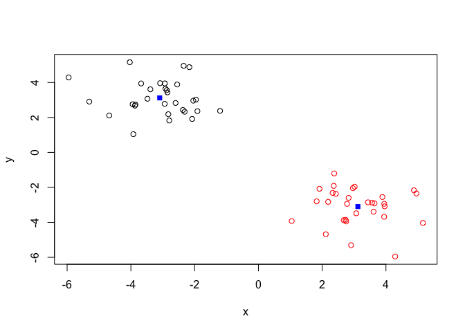
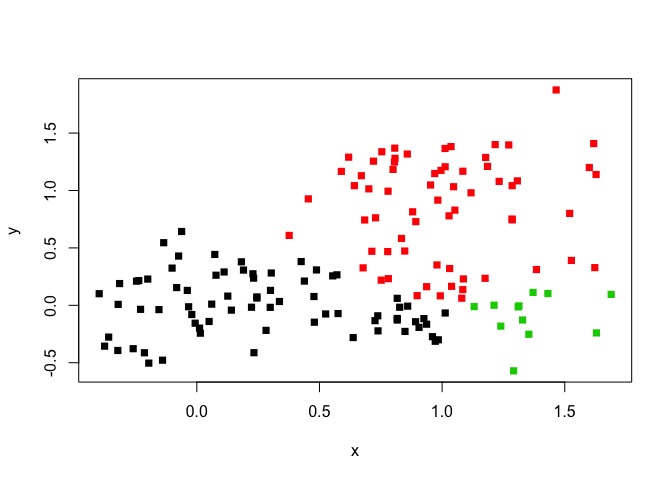

#Unstructured learning: K clustering

```r
# Generate some example data for clustering
tmp <- c(rnorm(30,-3), rnorm(30,3))
x <- cbind(x=tmp, y=rev(tmp))
plot(x)
```

<!-- -->

Our Tasks
Use the kmeans() function setting k to 2 and nstart=20

```r
km <- kmeans(x, centers = 2, nstart = 20)
print(km)
```

```
## K-means clustering with 2 clusters of sizes 30, 30
## 
## Cluster means:
##           x         y
## 1 -3.095894  3.120054
## 2  3.120054 -3.095894
## 
## Clustering vector:
##  [1] 1 1 1 1 1 1 1 1 1 1 1 1 1 1 1 1 1 1 1 1 1 1 1 1 1 1 1 1 1 1 2 2 2 2 2
## [36] 2 2 2 2 2 2 2 2 2 2 2 2 2 2 2 2 2 2 2 2 2 2 2 2 2
## 
## Within cluster sum of squares by cluster:
## [1] 59.25215 59.25215
##  (between_SS / total_SS =  90.7 %)
## 
## Available components:
## 
## [1] "cluster"      "centers"      "totss"        "withinss"    
## [5] "tot.withinss" "betweenss"    "size"         "iter"        
## [9] "ifault"
```


Inspect/print the results
Q. How many points are in each cluster?

```r
km$cluster
```

```
##  [1] 1 1 1 1 1 1 1 1 1 1 1 1 1 1 1 1 1 1 1 1 1 1 1 1 1 1 1 1 1 1 2 2 2 2 2
## [36] 2 2 2 2 2 2 2 2 2 2 2 2 2 2 2 2 2 2 2 2 2 2 2 2 2
```
Q. What ‘component’ of your result object details
- cluster size?

```r
km$size
```

```
## [1] 30 30
```

- cluster assignment/membership?

```r
km$cluster
```

```
##  [1] 1 1 1 1 1 1 1 1 1 1 1 1 1 1 1 1 1 1 1 1 1 1 1 1 1 1 1 1 1 1 2 2 2 2 2
## [36] 2 2 2 2 2 2 2 2 2 2 2 2 2 2 2 2 2 2 2 2 2 2 2 2 2
```

- cluster center?

```r
km$centers
```

```
##           x         y
## 1 -3.095894  3.120054
## 2  3.120054 -3.095894
```
Plot x colored by the kmeans cluster assignment and
add cluster centers as blue points

```r
#Color Coding only the clusters so far
plot(x, col = km$cluster)
#Now we make the centers blue and with a different shape
points(km$centers, col = "blue", pch=15)
```

<!-- -->
Repeat for k=3, which one has the better total SS? 

```r
#Repeat k cluster for k = 3
km2 <- kmeans(x, centers = 3, nstart = 20)
print(km2)
```

```
## K-means clustering with 3 clusters of sizes 18, 12, 30
## 
## Cluster means:
##           x         y
## 1 -3.550797  3.641030
## 2 -2.413539  2.338590
## 3  3.120054 -3.095894
## 
## Clustering vector:
##  [1] 1 1 2 2 1 2 1 1 1 2 1 2 1 1 2 1 1 1 1 2 2 2 1 2 1 1 1 1 2 2 3 3 3 3 3
## [36] 3 3 3 3 3 3 3 3 3 3 3 3 3 3 3 3 3 3 3 3 3 3 3 3 3
## 
## Within cluster sum of squares by cluster:
## [1] 29.195152  8.531106 59.252151
##  (between_SS / total_SS =  92.4 %)
## 
## Available components:
## 
## [1] "cluster"      "centers"      "totss"        "withinss"    
## [5] "tot.withinss" "betweenss"    "size"         "iter"        
## [9] "ifault"
```


```r
plot(x, col = km2$cluster)
points(km2$centers, col = "blue", pch = 15)
```

<!-- -->

#Hierarchial Clustering

Lets try on our X plot

```r
#First we need to calculate point(dis)similarity
#as the euclidean distance between observations
dist_matrix <- dist(x) 
hc <- hclust(d = dist_matrix)

# the print method is not so useful here so we use plot
hc
```

```
## 
## Call:
## hclust(d = dist_matrix)
## 
## Cluster method   : complete 
## Distance         : euclidean 
## Number of objects: 60
```
Lets draw the tree (plot)

```r
#You can choose how many clusters you want and simply move down #  from the top
plot(hc)
abline(h=6, col = "red")
```

<!-- -->

```r
cutree(hc, h=6) # Cut by height h
```

```
##  [1] 1 1 1 1 1 1 1 1 1 1 1 1 1 1 1 1 1 1 1 1 1 1 1 1 1 1 1 1 1 1 2 2 2 2 2
## [36] 2 2 2 2 2 2 2 2 2 2 2 2 2 2 2 2 2 2 2 2 2 2 2 2 2
```

I can 'cut' the tree at any height to give our clustsers...


```r
#cut at height 6
cutree(hc, h = 6)
```

```
##  [1] 1 1 1 1 1 1 1 1 1 1 1 1 1 1 1 1 1 1 1 1 1 1 1 1 1 1 1 1 1 1 2 2 2 2 2
## [36] 2 2 2 2 2 2 2 2 2 2 2 2 2 2 2 2 2 2 2 2 2 2 2 2 2
```

Or ask it to cut yieling 'k' clusters

```r
#give me 4 clusters
cutree(hc, k = 4)
```

```
##  [1] 1 2 1 2 2 1 1 1 2 1 2 1 1 1 1 2 1 1 1 1 1 1 1 1 2 2 1 1 1 1 3 3 3 3 4
## [36] 4 3 3 3 3 3 3 3 3 4 3 3 3 3 4 3 4 3 3 3 4 4 3 4 3
```

Method of clustering matters too!

```r
#You can argue using: complete, single, average, centroid 
#hc.complete <- hclust(d, method="complete")
#hc.average <- hclust(d, method="average")
#hc.single <- hclust(d, method="single")
```


My Turn

```r
# Step 1. Generate some example data for clustering
x <- rbind(
 matrix(rnorm(100, mean=0, sd = 0.3), ncol = 2), # c1
 matrix(rnorm(100, mean = 1, sd = 0.3), ncol = 2), # c2
 matrix(c(rnorm(50, mean = 1, sd = 0.3), # c3
 rnorm(50, mean = 0, sd = 0.3)), ncol = 2))
colnames(x) <- c("x", "y")
# Step 2. Plot the data without clustering
plot(x)
```

<!-- -->

```r
# Step 3. Generate colors for known clusters
# (just so we can compare to hclust results)
col <- as.factor( rep(c("c1","c2","c3"), each=50) )
plot(x, col=col)
```

<!-- -->

Q. Use the dist(), hclust(), plot() and cutree() functions to return 2 and 3 clusters

```r
#ALWAYS NEED TO ADD DIST TO HCLUST
clust <- hclust(dist(x))
plot(clust)
```

<!-- -->


```r
#to produce 2 clusters change out k
members2 <- cutree(clust, k = 2)
members3 <- cutree(clust, k = 3)

#Lets look at both (remember to cbind the new cutree info to be #  able to plot it)
cbind(k2 =members2, k3 = members3)
```

```
##        k2 k3
##   [1,]  1  1
##   [2,]  1  1
##   [3,]  1  1
##   [4,]  1  1
##   [5,]  1  1
##   [6,]  1  1
##   [7,]  1  1
##   [8,]  1  1
##   [9,]  1  1
##  [10,]  1  1
##  [11,]  1  1
##  [12,]  1  1
##  [13,]  1  1
##  [14,]  1  1
##  [15,]  1  1
##  [16,]  1  1
##  [17,]  1  1
##  [18,]  1  1
##  [19,]  1  1
##  [20,]  1  1
##  [21,]  1  1
##  [22,]  1  1
##  [23,]  1  1
##  [24,]  1  1
##  [25,]  2  2
##  [26,]  1  1
##  [27,]  1  1
##  [28,]  1  1
##  [29,]  1  1
##  [30,]  1  1
##  [31,]  1  1
##  [32,]  1  1
##  [33,]  1  1
##  [34,]  1  1
##  [35,]  1  1
##  [36,]  1  1
##  [37,]  1  1
##  [38,]  1  1
##  [39,]  1  1
##  [40,]  1  1
##  [41,]  1  1
##  [42,]  1  1
##  [43,]  1  1
##  [44,]  1  1
##  [45,]  1  1
##  [46,]  1  1
##  [47,]  1  1
##  [48,]  1  1
##  [49,]  1  1
##  [50,]  1  1
##  [51,]  2  2
##  [52,]  2  2
##  [53,]  2  2
##  [54,]  2  2
##  [55,]  2  2
##  [56,]  2  2
##  [57,]  2  2
##  [58,]  2  2
##  [59,]  2  2
##  [60,]  2  2
##  [61,]  2  2
##  [62,]  2  2
##  [63,]  2  2
##  [64,]  2  2
##  [65,]  2  2
##  [66,]  2  2
##  [67,]  2  2
##  [68,]  2  2
##  [69,]  2  2
##  [70,]  2  2
##  [71,]  2  2
##  [72,]  2  2
##  [73,]  2  2
##  [74,]  2  2
##  [75,]  2  2
##  [76,]  2  2
##  [77,]  2  2
##  [78,]  2  2
##  [79,]  2  2
##  [80,]  2  2
##  [81,]  2  2
##  [82,]  2  2
##  [83,]  2  2
##  [84,]  2  2
##  [85,]  2  2
##  [86,]  2  2
##  [87,]  2  2
##  [88,]  2  2
##  [89,]  2  2
##  [90,]  2  2
##  [91,]  2  2
##  [92,]  2  2
##  [93,]  2  2
##  [94,]  2  2
##  [95,]  2  2
##  [96,]  2  2
##  [97,]  2  2
##  [98,]  2  2
##  [99,]  2  2
## [100,]  2  2
## [101,]  1  1
## [102,]  1  1
## [103,]  1  1
## [104,]  1  3
## [105,]  1  1
## [106,]  1  3
## [107,]  2  2
## [108,]  1  1
## [109,]  2  2
## [110,]  2  2
## [111,]  1  3
## [112,]  1  3
## [113,]  2  2
## [114,]  1  1
## [115,]  1  3
## [116,]  1  1
## [117,]  1  1
## [118,]  2  2
## [119,]  2  2
## [120,]  1  3
## [121,]  1  3
## [122,]  2  2
## [123,]  1  1
## [124,]  1  1
## [125,]  1  1
## [126,]  1  1
## [127,]  1  3
## [128,]  1  1
## [129,]  1  1
## [130,]  1  1
## [131,]  2  2
## [132,]  1  3
## [133,]  1  1
## [134,]  1  1
## [135,]  1  3
## [136,]  2  2
## [137,]  1  1
## [138,]  1  1
## [139,]  1  1
## [140,]  2  2
## [141,]  1  1
## [142,]  2  2
## [143,]  1  3
## [144,]  1  1
## [145,]  2  2
## [146,]  1  1
## [147,]  1  3
## [148,]  1  1
## [149,]  2  2
## [150,]  2  2
```

```r
plot(x, col =members3, pch =15)
```

<!-- -->

##How to do PCA in R

#prcomp function in PCA
Making up data

```r
## Initialize a blank 100 row by 10 column matrix
mydata <- matrix(nrow=100, ncol=10)
## Lets label the rows gene1, gene2 etc. to gene100
#Paste makes strings of character values
rownames(mydata) <- paste("gene", 1:100, sep="")
## Lets label the first 5 columns wt1, wt2, wt3, wt4 and wt5
## and the last 5 ko1, ko2 etc. to ko5 (for "knock-out")
colnames(mydata) <- c( paste("wt", 1:5, sep=""),
 paste("ko", 1:5, sep="") )
## Fill in some fake read counts
for(i in 1:nrow(mydata)) {
 wt.values <- rpois(5, lambda=sample(x=10:1000, size=1))
 ko.values <- rpois(5, lambda=sample(x=10:1000, size=1))

 mydata[i,] <- c(wt.values, ko.values)
}
head(mydata)
```

```
##       wt1 wt2 wt3  wt4 wt5 ko1 ko2 ko3 ko4 ko5
## gene1  97  85  93   98 113 210 228 196 225 221
## gene2 851 840 839  824 846 578 540 555 500 517
## gene3 695 760 758  698 743 281 279 248 287 268
## gene4 952 934 979 1023 973 802 849 849 813 835
## gene5 687 659 690  644 676 572 578 590 576 563
## gene6 652 669 688  634 647 919 902 941 964 958
```

Use prcomp

```r
#prcomp flips data so you need to reflip it again (t = transpose = flips)
#head(t(mydata))
```


```r
pca <- prcomp( t(mydata), scale = TRUE )
pca
```

```
## Standard deviations (1, .., p=10):
##  [1] 9.488624e+00 1.760829e+00 1.344274e+00 1.207476e+00 1.001400e+00
##  [6] 9.202053e-01 8.883933e-01 7.625680e-01 6.165172e-01 2.946339e-15
## 
## Rotation (n x k) = (100 x 10):
##                 PC1           PC2           PC3           PC4          PC5
## gene1    0.10389287 -1.648355e-02  4.099031e-02  0.0544263526  0.016427593
## gene2   -0.10460731  1.278767e-02 -3.413983e-02 -0.0420036746  0.002545955
## gene3   -0.10471560 -2.450353e-02 -1.035557e-02  0.0276132750 -0.087859123
## gene4   -0.09955868 -2.699270e-02 -1.000372e-02 -0.0203984120  0.087497414
## gene5   -0.10155301 -3.239902e-02 -2.532606e-02 -0.0530406959  0.107555032
## gene6    0.10421108  3.537111e-04  7.674190e-03 -0.0307831769 -0.033832291
## gene7    0.10486330  1.296996e-02  2.147857e-02  0.0420077197 -0.033066159
## gene8   -0.04566315  2.148067e-01 -1.673928e-01 -0.6232093415  0.136956609
## gene9   -0.10359564 -4.642035e-02  7.814367e-02  0.0341460238  0.049873091
## gene10   0.10403881 -1.467780e-03  3.779868e-02  0.0301742926 -0.033600733
## gene11  -0.06466298 -2.804094e-02 -4.699556e-01 -0.0015874371 -0.255348201
## gene12  -0.10293209 -1.671638e-02  4.752849e-02  0.0171791462  0.079584397
## gene13   0.09621367  2.839554e-02  3.842336e-02 -0.0471378703 -0.240565400
## gene14   0.10517052  1.159759e-02 -2.331562e-02 -0.0225517316  0.019655849
## gene15  -0.10431667  1.736345e-02  9.531934e-03  0.0799328356 -0.071691754
## gene16   0.10527538  1.428130e-03  5.174396e-03 -0.0086946952  0.001784552
## gene17  -0.10374562  6.578473e-02  1.362144e-02  0.0271261573  0.086854516
## gene18  -0.08976063  4.482918e-02  9.599543e-02 -0.0263312045  0.251464778
## gene19  -0.10502520  9.394397e-03  2.972885e-02  0.0296586217  0.051413303
## gene20   0.10046672 -9.901120e-02  2.149285e-02  0.0858760858  0.005478626
## gene21  -0.10505594 -1.107373e-02 -1.128572e-03 -0.0109687350 -0.064539375
## gene22  -0.10535162 -2.356049e-03  3.196666e-03  0.0135099843 -0.006663327
## gene23  -0.10513409  1.060353e-03  2.150274e-02  0.0097611069 -0.034337617
## gene24   0.10442580 -5.797713e-02 -7.399972e-03 -0.0025372067  0.078017651
## gene25  -0.10524385  3.347077e-03  6.021403e-03  0.0078561632  0.016198316
## gene26   0.10117756  3.401406e-02 -5.354475e-02 -0.1161041682  0.005649934
## gene27   0.01771828 -5.303912e-01  9.120153e-02  0.0787666066 -0.245661885
## gene28   0.10528436  5.510191e-03  7.664762e-05 -0.0230473372  0.010630971
## gene29   0.10514270  1.623764e-02 -8.522103e-05 -0.0094931511 -0.021124107
## gene30  -0.09811029 -6.401418e-02 -1.740403e-02 -0.2218092787 -0.086528645
## gene31  -0.10467019 -3.179634e-03 -2.061481e-02  0.0385437914 -0.091372433
## gene32   0.10262120 -6.304585e-02  8.185587e-02 -0.0119813663  0.067278969
## gene33   0.10472328 -6.213445e-03 -1.923913e-02 -0.0784790090  0.033289552
## gene34  -0.10391340 -3.050186e-02 -2.905039e-02  0.0315525037 -0.078076189
## gene35   0.05094595  3.578075e-01 -3.766185e-01  0.0314558027 -0.192458382
## gene36   0.10059700 -6.608423e-03 -4.181116e-04  0.1296363837  0.053121717
## gene37   0.10515201 -4.581708e-03  1.570988e-02 -0.0022937635  0.025995119
## gene38   0.10464668  3.005240e-02  4.643883e-02 -0.0121612429  0.017389631
## gene39  -0.10521864 -2.925543e-03 -9.598814e-03  0.0185811558 -0.044576331
## gene40   0.10530897 -3.290173e-03  7.726287e-03 -0.0192575173  0.018089359
## gene41   0.10473949 -1.940997e-02 -2.923376e-02  0.0235035149 -0.032931235
## gene42   0.10519545 -1.597177e-02  7.712309e-03 -0.0244262149  0.036920158
## gene43   0.10522093 -6.867275e-03 -9.708179e-03 -0.0095124729  0.044324843
## gene44   0.08803898 -2.056795e-01 -7.632070e-02 -0.0818224636  0.189429955
## gene45   0.10481479 -7.751328e-03  4.076400e-02 -0.0494077663 -0.008250167
## gene46   0.10426530 -5.559414e-02 -4.598471e-02  0.0040403907  0.031945912
## gene47  -0.09469280  2.461701e-02 -1.074741e-02 -0.3109398621  0.094266052
## gene48   0.10216307  4.168370e-02 -1.052280e-01  0.0182711339 -0.044479918
## gene49   0.09667668  9.450795e-02 -1.786393e-01 -0.0385923461 -0.008251828
## gene50   0.09975110 -5.422623e-02  1.047514e-01  0.1620035195 -0.044288239
## gene51  -0.10451656 -1.434895e-02  4.566607e-03  0.0734478521 -0.020461956
## gene52   0.10506273  2.234024e-02  2.022174e-03 -0.0321774553 -0.013917853
## gene53  -0.10509512 -2.152612e-03  4.622239e-03  0.0348130753 -0.034396542
## gene54  -0.10499058 -2.876403e-03 -4.810401e-05 -0.0001932512  0.005097730
## gene55   0.10530896 -8.230335e-03  1.472338e-02 -0.0090039602  0.010083891
## gene56  -0.10417912  2.308833e-02  2.612217e-02  0.0525888656  0.047646999
## gene57  -0.10470523  2.028323e-02 -1.767507e-02  0.0689986689 -0.027674473
## gene58  -0.10481412  2.508508e-03  4.027582e-02  0.0251877905  0.030888789
## gene59  -0.10493900  6.248617e-03 -6.191540e-03  0.0291591211 -0.036812850
## gene60   0.10504210 -6.881748e-05 -4.829222e-02  0.0150534669 -0.019804561
## gene61  -0.10487647 -7.137949e-03  5.198274e-02  0.0370229335  0.034082488
## gene62  -0.10528353  3.251096e-03  2.296199e-02 -0.0044118538  0.008824389
## gene63  -0.10221513  6.213413e-02  2.742472e-02 -0.0420507175  0.012217036
## gene64   0.10482533 -3.365253e-02  1.790276e-02 -0.0577315711 -0.010436230
## gene65   0.10460216 -3.624304e-02  3.865476e-02 -0.0500117471  0.045499578
## gene66   0.10502976  1.539765e-02 -2.810981e-02 -0.0380088396  0.018787079
## gene67  -0.10505284 -1.107398e-02 -2.469354e-02 -0.0063551539 -0.064461835
## gene68  -0.05739833 -3.390161e-01 -3.345971e-01 -0.0936906260 -0.277559430
## gene69   0.09913499  1.194051e-01 -5.336274e-02  0.0123574406 -0.052942932
## gene70  -0.10523956 -7.418736e-03  3.560430e-03  0.0221756351 -0.022582814
## gene71   0.10319750 -4.135829e-02 -1.218460e-02 -0.0286581117  0.004956108
## gene72  -0.10286513 -4.957543e-02 -8.810583e-03  0.0046062142 -0.086785166
## gene73   0.10527420 -7.485789e-03  1.856149e-02 -0.0253281019  0.003320354
## gene74   0.10412493  1.765002e-02 -3.348128e-02  0.0187701352 -0.021425453
## gene75   0.10440916  5.622101e-03  5.656220e-02 -0.0150971864  0.011148270
## gene76   0.10514638  1.294087e-02 -8.914488e-03  0.0032275707  0.024222820
## gene77  -0.04339982  4.116423e-02  3.868822e-01 -0.3649525002 -0.442197789
## gene78  -0.10460208 -2.395935e-03 -1.674692e-02  0.0777640676  0.003044984
## gene79  -0.10514252 -8.603182e-03 -2.132600e-02  0.0398532303 -0.018009126
## gene80  -0.10264745  6.669388e-02 -4.465786e-02  0.0532955121  0.158647754
## gene81   0.10486166  8.519688e-03 -3.547610e-03 -0.0066810918  0.006260017
## gene82  -0.10424368 -2.011638e-02  3.487102e-02 -0.0046153230  0.021037528
## gene83  -0.10224605 -3.119291e-02 -5.131656e-02  0.0802920200 -0.065363186
## gene84  -0.10480395 -2.195800e-02 -8.630973e-03  0.0340243370 -0.036989699
## gene85   0.03671578  3.296380e-01  4.030894e-01  0.0400964953 -0.322908694
## gene86  -0.10516906  1.220147e-02 -9.001927e-03  0.0340946313 -0.018118822
## gene87   0.10068680 -4.177792e-02  4.818577e-02 -0.0042224638 -0.001996820
## gene88  -0.10519300 -1.526722e-02 -8.735713e-03  0.0098776013 -0.018555161
## gene89  -0.06049910 -3.521532e-01  7.291046e-02 -0.3445969906  0.068935769
## gene90  -0.10131662  6.633561e-02  1.170971e-01 -0.0091621705  0.079683686
## gene91  -0.10451786 -1.208447e-02 -1.653365e-02 -0.0049610958  0.083689887
## gene92  -0.10111505  1.077738e-01  2.512331e-02  0.0253109785  0.147862504
## gene93   0.10187657 -8.448936e-02  5.135868e-02 -0.1106388001  0.098899481
## gene94   0.10406371 -4.514691e-02 -1.744352e-02 -0.0001289362  0.016146703
## gene95   0.10395429 -4.880048e-02  4.322932e-02 -0.0213931316  0.094344462
## gene96  -0.09726896  1.283881e-01 -2.045396e-02  0.0217737756 -0.015139791
## gene97   0.09630550  1.176732e-01 -6.528174e-02 -0.0677667188 -0.207058892
## gene98   0.10233698  3.207835e-02 -1.013492e-01  0.1218284027  0.047678460
## gene99   0.10514624 -8.707744e-03  3.884676e-02 -0.0237930389 -0.013476602
## gene100  0.10509077  3.007411e-02 -4.061520e-03 -0.0231523509  0.026368176
##                   PC6           PC7           PC8           PC9
## gene1    5.502808e-02 -4.732140e-02  0.0991348171  0.1596096277
## gene2    7.750689e-03  9.696446e-02 -0.0278170115  0.0663377358
## gene3   -7.780282e-04  2.953446e-02  0.0432827041 -0.0124422566
## gene4    2.152156e-01 -2.415644e-01 -0.1410381716 -0.0077025744
## gene5    3.633883e-02  1.459207e-01  0.2149590089 -0.1314612625
## gene6   -6.103363e-02 -3.560870e-02  0.1066586333 -0.1524084476
## gene7   -1.465413e-02 -5.871717e-02 -0.0339210795  0.0598541570
## gene8   -4.231593e-02 -1.713382e-01 -0.1229827751 -0.0042628357
## gene9   -9.086874e-03  3.068540e-02  0.1214423431 -0.0802984830
## gene10   7.981614e-02  7.338288e-02  0.1144454206 -0.0911247781
## gene11  -3.875657e-02  3.123302e-01 -0.3047208467 -0.2530966671
## gene12   1.356163e-01 -2.401439e-02  0.1540312007 -0.1092044276
## gene13   7.049034e-02  1.425179e-01  0.3456837249 -0.1652604399
## gene14  -1.864405e-03 -3.785480e-02  0.0006067448  0.0357638788
## gene15   6.356430e-03  7.276137e-02  0.0006128687  0.0352270763
## gene16  -3.144494e-02  6.109715e-03  0.0337185343  0.0350093193
## gene17  -7.472853e-02 -2.438650e-02  0.0760275443 -0.0007238379
## gene18   3.958775e-02  4.646241e-01 -0.1565420256 -0.0593183212
## gene19  -2.256724e-02 -2.223667e-02 -0.0058751565 -0.0258123306
## gene20  -6.522211e-02  1.760802e-02  0.0968210088  0.3241029424
## gene21   2.657360e-02 -3.099497e-05  0.0389701755 -0.0163241713
## gene22  -1.568832e-03  1.087160e-03 -0.0175589779 -0.0222123433
## gene23  -3.843413e-05 -1.790773e-02 -0.0503448384 -0.0500216107
## gene24  -8.212404e-03 -2.198261e-02  0.0033310902 -0.0543592109
## gene25  -3.431300e-03  6.180155e-03  0.0558892206  0.0343943211
## gene26  -9.486476e-02  2.178197e-01 -0.0188795320 -0.1100510852
## gene27   5.494047e-02 -1.973807e-02 -0.0542648494 -0.1649542970
## gene28  -1.371220e-02 -3.219815e-02  0.0070906972  0.0028254985
## gene29   1.966650e-02  2.503264e-02  0.0455578466  0.0573463739
## gene30  -1.331701e-01 -6.150484e-02  0.1307159255 -0.1844695992
## gene31  -6.542124e-03  2.893525e-02  0.0469432939  0.0273870305
## gene32  -1.144538e-01  3.671402e-02 -0.1324554508  0.0282418617
## gene33   1.191597e-03  1.773796e-03  0.0110039665  0.0658218549
## gene34  -2.232987e-02 -3.200084e-02 -0.1545784012 -0.0433453409
## gene35   9.231548e-02 -5.807001e-02  0.2891842089  0.2048972796
## gene36   2.409645e-01 -5.981558e-02 -0.0797164555 -0.1227134336
## gene37  -4.180348e-02 -1.315836e-02 -0.0526333000  0.0140954368
## gene38  -6.579044e-02 -6.126218e-02  0.0185187296 -0.0020064725
## gene39   7.813807e-03  4.118099e-03  0.0171875759 -0.0286138303
## gene40  -2.352550e-02 -6.459677e-03  0.0047498722  0.0004266979
## gene41  -7.902287e-02 -1.285996e-03  0.0476349342 -0.0533232017
## gene42  -2.127117e-02  1.218800e-02  0.0049565680 -0.0083579263
## gene43   1.336921e-02 -2.566699e-02 -0.0024323732 -0.0162464766
## gene44   1.613744e-01  2.879083e-01  0.1161903138  0.2259204453
## gene45   2.456957e-02 -2.371262e-02  0.0094455002  0.0895873527
## gene46  -8.041495e-03  8.047518e-02 -0.0519247540 -0.0092749450
## gene47  -7.118337e-02  1.897864e-01  0.0087098017  0.1447531348
## gene48   9.590683e-02 -1.527877e-01  0.0245142804 -0.1241549270
## gene49   2.653070e-01 -8.406751e-02 -0.0679264881 -0.0894924976
## gene50   1.297177e-01  1.534070e-01  0.0288327249  0.0659411911
## gene51   1.246520e-02  9.329390e-02  0.0299473275 -0.0054151372
## gene52   9.302252e-03  4.620331e-02 -0.0076862179  0.0547107274
## gene53  -6.649303e-03  1.370925e-02  0.0639999254  0.0023303329
## gene54   2.343482e-02  9.171027e-03  0.0375204691  0.1272184317
## gene55   6.737468e-03 -6.944117e-03  0.0206523483 -0.0315655639
## gene56  -1.434812e-02 -3.388846e-02 -0.1384999388  0.0607993079
## gene57  -3.911469e-02  3.538192e-02 -0.0245220855 -0.0446625510
## gene58   6.900859e-03  7.768452e-02  0.0250274611 -0.0482924442
## gene59  -1.805509e-02 -2.744282e-02 -0.0911978818 -0.0092397107
## gene60   2.602731e-03 -1.165565e-02  0.0235863118 -0.0562947932
## gene61   2.636751e-03 -3.396535e-02 -0.0213159296  0.0292213325
## gene62   2.041457e-02  1.226052e-02  0.0176050660 -0.0263362035
## gene63   1.192128e-01 -6.601448e-03  0.0999169690 -0.2585067352
## gene64  -3.211121e-02  2.485554e-02  0.0119815003  0.0212618850
## gene65   1.924910e-02  4.747280e-02  0.0102511994 -0.0248102468
## gene66   3.311443e-02  7.771465e-03 -0.0455148497 -0.0047220668
## gene67   1.477940e-02 -8.155984e-03  0.0050463126  0.0330712391
## gene68  -1.630391e-01  1.345528e-02 -0.0015392785  0.2902027439
## gene69  -2.386809e-01  9.050326e-02 -0.1147810079 -0.0331730816
## gene70   2.046310e-02 -1.914927e-02  0.0364888620  0.0011736266
## gene71  -5.173259e-02 -6.741813e-03 -0.2325984995 -0.0399365776
## gene72   4.140544e-02 -1.521501e-01  0.0025431894  0.1795886586
## gene73  -1.187529e-02  1.895794e-02  0.0023992744  0.0096057428
## gene74   1.027172e-01  3.211274e-02 -0.0659447776 -0.1414876112
## gene75  -6.126009e-02  5.907799e-02  0.1036356642  0.0012488538
## gene76   7.233812e-03 -3.194668e-02 -0.0267826790 -0.0738420261
## gene77   3.848898e-01  1.222919e-01 -0.1936991266  0.1185638789
## gene78  -3.532606e-02 -2.608930e-02 -0.0218651416  0.0981535562
## gene79  -2.540772e-02  1.521476e-02  0.0184005793  0.0125899337
## gene80  -5.027631e-02 -4.149811e-02 -0.0293806226 -0.0390379329
## gene81   3.977581e-02  1.487673e-02 -0.0222066660 -0.1435822783
## gene82   1.208068e-01 -7.223993e-02 -0.0055447516 -0.0562368428
## gene83  -2.016600e-01 -3.937276e-02  0.0520792346  0.0131885947
## gene84  -6.680822e-03  4.094836e-02  0.0153302620 -0.1134408259
## gene85  -4.025040e-01 -1.432726e-02 -0.0813927746  0.0022209688
## gene86   1.601223e-03  2.149048e-02  0.0409584934 -0.0230582585
## gene87  -2.451435e-01  1.817462e-01  0.0079195633 -0.0403664758
## gene88   3.503939e-02  1.237514e-03  0.0425086475 -0.0272969561
## gene89  -2.295405e-01 -1.212682e-01  0.2473774941 -0.1322603286
## gene90   2.309884e-02  4.134249e-02  0.2236377086 -0.0008011983
## gene91  -6.310874e-02 -4.749662e-02  0.0591327312  0.0579779583
## gene92  -8.945114e-02  8.162476e-02 -0.0312905276 -0.1342858490
## gene93   5.945752e-02  6.996840e-02 -0.0129435962  0.1031237149
## gene94  -3.568058e-02 -1.095449e-01 -0.0130681799 -0.1378208845
## gene95   3.486741e-02  7.129755e-02  0.0267662877 -0.0570287667
## gene96   6.140182e-02  3.158092e-01  0.0979394089  0.1441270258
## gene97   5.385009e-02  6.616575e-02  0.2896918994 -0.1615696797
## gene98  -1.068149e-01  3.716509e-02  0.0077882307 -0.0406672179
## gene99  -1.682913e-02  1.810767e-02  0.0029617910  0.0188540987
## gene100  2.442770e-02  1.526423e-02 -0.0163409130  0.0363109585
##                  PC10
## gene1   -0.0632814203
## gene2   -0.1222806164
## gene3    0.1239211531
## gene4    0.0740693371
## gene5    0.0493828061
## gene6    0.0178169991
## gene7   -0.0629252552
## gene8    0.2006291747
## gene9   -0.0317435264
## gene10  -0.0328583465
## gene11  -0.1694573825
## gene12   0.1104261773
## gene13   0.2661756884
## gene14  -0.0246852678
## gene15  -0.0989678285
## gene16   0.0230505856
## gene17  -0.0727023931
## gene18  -0.0388254685
## gene19   0.0301171477
## gene20   0.1660297431
## gene21   0.0140415982
## gene22   0.0023859058
## gene23   0.0013749766
## gene24  -0.1412071909
## gene25  -0.0035751818
## gene26   0.0921081574
## gene27   0.1933307448
## gene28  -0.0051187043
## gene29  -0.0580345101
## gene30   0.0223610529
## gene31  -0.0758557225
## gene32  -0.0209633456
## gene33   0.0101957690
## gene34   0.0192567145
## gene35  -0.2047151707
## gene36  -0.0689738272
## gene37   0.0315249349
## gene38  -0.0338312288
## gene39  -0.0098933455
## gene40  -0.0004682487
## gene41  -0.0356423492
## gene42  -0.0307017985
## gene43  -0.0388456183
## gene44  -0.2521680817
## gene45   0.0247631415
## gene46   0.0573607541
## gene47   0.0371273233
## gene48  -0.0386649253
## gene49   0.1998384459
## gene50   0.0414331614
## gene51   0.0749755003
## gene52   0.0118423891
## gene53   0.0190197703
## gene54   0.0575843674
## gene55  -0.0160523258
## gene56   0.0163523278
## gene57  -0.0544762578
## gene58   0.0183596068
## gene59   0.0456680606
## gene60   0.0096659080
## gene61  -0.0097341305
## gene62   0.0149088600
## gene63   0.1023740378
## gene64   0.0471798605
## gene65   0.0214821731
## gene66   0.0509035234
## gene67   0.0536854652
## gene68   0.1163000187
## gene69   0.0175254855
## gene70  -0.0364140604
## gene71   0.1355901818
## gene72   0.0311350316
## gene73   0.0313482068
## gene74   0.0441849298
## gene75  -0.0957247688
## gene76  -0.0228478053
## gene77  -0.3092552538
## gene78  -0.0784044218
## gene79   0.0106920387
## gene80   0.0587642356
## gene81  -0.0586279781
## gene82  -0.0116512011
## gene83  -0.0923977281
## gene84  -0.0371198450
## gene85   0.0505637096
## gene86  -0.0093314131
## gene87   0.1081408962
## gene88   0.0150134738
## gene89  -0.2966999048
## gene90   0.0015632705
## gene91  -0.0291225244
## gene92  -0.1377696416
## gene93   0.1848842366
## gene94  -0.1273416980
## gene95  -0.0374389057
## gene96   0.3005121587
## gene97  -0.0152311386
## gene98  -0.2117445276
## gene99  -0.0069350675
## gene100  0.0439605915
```


```r
## A basic PC1 vs PC2 plot 2-D
attributes(pca)
```

```
## $names
## [1] "sdev"     "rotation" "center"   "scale"    "x"       
## 
## $class
## [1] "prcomp"
```

```r
#x is  the name for our data so we use that in our PCA analysis
plot(pca$x[,1], pca$x[,2])
```

<!-- -->

How well are our PC's capturing our data spread (i.e. variance)


```r
##percent variance is often more informative to look at
pca.var <- pca$sdev^2
pca.var.per <- round(pca.var/sum(pca.var)*100, 1)

pca.var.per
```

```
##  [1] 90.0  3.1  1.8  1.5  1.0  0.8  0.8  0.6  0.4  0.0
```

plot our scree plot


```r
barplot(pca.var.per, main="Scree Plot",
 xlab="Principal Component", ylab="Percent Variation")
```

<!-- -->


```r
#color up our PCA plot
colvec <- colnames(mydata)
colvec[grep("wt", colvec)] <- "red"
colvec[grep("ko", colvec)] <- "blue"
plot(pca$x[,1], pca$x[,2], col=colvec, pch=16,
 xlab=paste0("PC1 (", pca.var.per[1], "%)"),
 ylab=paste0("PC2 (", pca.var.per[2], "%)")) 
```

<!-- -->

Add some labels to points

```r
plot(pca$x[,1], pca$x[,2], col=colvec, pch=16,
 xlab=paste0("PC1 (", pca.var.per[1], "%)"),
 ylab=paste0("PC2 (", pca.var.per[2], "%)")) 
identify(pca$x[,1], pca$x[,2], labels=colnames(mydata))
```

<!-- -->

```
## integer(0)
```

Loading scores

```r
loading_scores <- pca$rotation[,1]
summary(loading_scores)
```

```
##      Min.   1st Qu.    Median      Mean   3rd Qu.      Max. 
## -0.105352 -0.104367  0.027217  0.002391  0.104413  0.105309
```

```r
## We are interested in the magnitudes of both plus
## and minus contributing genes
gene_scores <- abs(loading_scores) 
```

UK Foods Hands On

```r
#x <- read.csv("~/Downloads/UK_foods.csv")
#dim(x)
```


