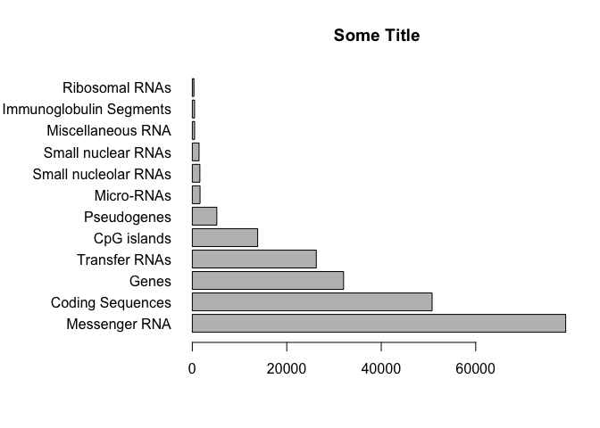

```r
# Class 4/17 (5)

# Box Plots
boxplot(( rnorm(1000,0)))
```

<!-- -->

```r
hist (rnorm(1000,0))
```

<!-- -->

```r
summary (rnorm(1000,0))
```

```
##      Min.   1st Qu.    Median      Mean   3rd Qu.      Max. 
## -3.220910 -0.673301 -0.003119 -0.003371  0.664003  3.426011
```

```r
#Flip my boxplot
boxplot (rnorm(1000,0), horizontal = TRUE)
```

<!-- -->

```r
#Read first data file
baby <- read.table(("bimm143_05_rstats/weight_chart.txt"), header = TRUE)

#Point and line plot
plot(baby, typ = "b", pch = 15, 
     cex = 1.5, lwd = 2, 
     main = "Some main title", 
     xlab = "Age (months)" , 
     ylab = "Weight (kg)" , 
     ylim= c(0,20))
```

<!-- -->

```r
# You can save plot by clicking export
# Section 1B feature_counts
# Tabs separate data
feat <- read.table("bimm143_05_rstats/feature_counts.txt"
           , sep= "\t"
           , header = TRUE)
#make a bar plot
par()$mar
```

```
## [1] 5.1 4.1 4.1 2.1
```

```r
par(mar=c(5,11,4,2))
barplot(feat[,2], horiz = TRUE
        , ylab = NULL
        , names.arg = feat [,1]
        , main = "Some Title"
        , las = 1)
```

<!-- -->

```r
# Par = global parameter settings for graphs
#Section 2A
mf_counts <- read.table("bimm143_05_rstats/male_female_counts.txt"
          , sep = "\t"
          , header = TRUE)
barplot(mf_counts[,2], horiz = TRUE,
        col = rainbow( nrow(mf_counts)),
        names.arg = mf_counts[,1],
        las = 1)
```

<!-- -->

```r
#Section 2B
file_2b <- "bimm143_05_rstats/up_down_expression.txt"
expression <- read.delim(file_2b)
palette(c("blue","gray","red"))
plot(expression$Condition1,
      expression$Condition2,
     col = expression$State)
```

<!-- -->

```r
#Section 2C
file_2c <- "bimm143_05_rstats/expression_methylation.txt"
methyl <- read.delim(file_2c)
```


---
title: "graphs.R"
author: "matthewtomaneng"
date: "Thu Apr 19 09:49:25 2018"
---
