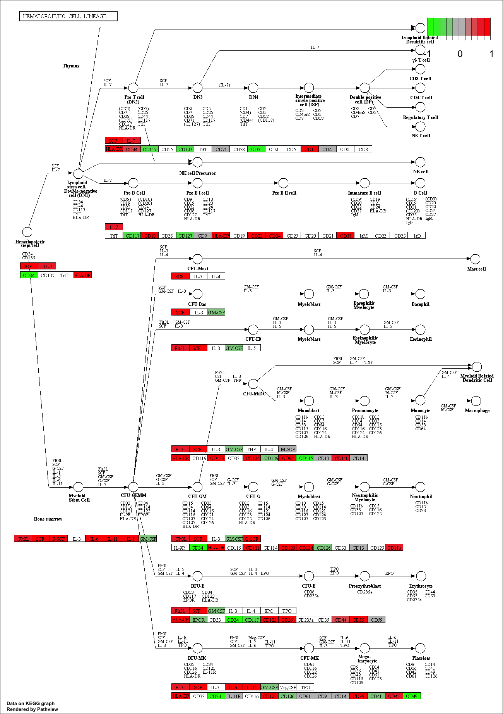

```{r setup, include=FALSE}
knitr::opts_chunk$set(echo = TRUE)
```
##Section 1
Use DESeq2 again

```{r}
#library(dplyr)
library(DESeq2)
```

load data files
```{r}
metaFile <- "data/GSE37704_metadata.csv"
countFile <- "data/GSE37704_featurecounts.csv"

# Import metadata and take a peak
colData = read.csv(metaFile, row.names=1)
head(colData)
```

```{r}
# Import countdata
countData = read.csv(countFile, row.names=1)
head(countData)
```

We want to get rid of the odd "Length" column
```{r}
# Note we need to remove the odd first $length col
countData <- as.matrix(countData[,-1])
head(countData)
```

Filter out 0's in data
```{r}
# Filter count data where you have 0 read count across all samples.
countData = countData[rowSums(countData)>1, ]
head(countData)
```

Now our data is usable for DESeq
```{r}
dds = DESeqDataSetFromMatrix(countData=countData,
                             colData=colData,
                             design=~condition)
dds = DESeq(dds)
```

Lets checkk out dds
```{r}
dds
```

#We are able to work with specific genes now
We will look at “hoxa1_kd” and “control_sirna”
```{r}
resultsNames(dds)
res = results(dds, contrast=c("condition", "hoxa1_kd", "control_sirna"))
```

Reorder p-values and call a summary to get a sense of which is up and down regulated
```{r}
res = res[order(res$pvalue),]
summary(res)
```

Our data is labeled with Ensembl notation but we need Entrez Gene ID's
```{r}
#This is calling out the data tables with the translation names
library("AnnotationDbi")
library("org.Hs.eg.db")

columns(org.Hs.eg.db)
```

We can use this to translate our Ensebl to Entrez
```{r}
#Transform symbol into the Ensembl ID
res$symbol = mapIds(org.Hs.eg.db,
                    keys=row.names(res), 
                    column="SYMBOL",
                    keytype="ENSEMBL",
                    multiVals="first")

#Transform EntrezID to Ensembl
res$entrez = mapIds(org.Hs.eg.db,
                    keys=row.names(res), 
                    column="ENTREZID",
                    keytype="ENSEMBL",
                    multiVals="first")

#Transform the genename to Ensembl
res$name =   mapIds(org.Hs.eg.db,
                    keys=row.names(res), 
                    column="GENENAME",
                    keytype="ENSEMBL",
                    multiVals="first")

head(res, 10)
```

##Section 2: Pathway Analysis
Download packages we need
```{r}
#source("http://bioconductor.org/biocLite.R")
#biocLite( c("pathview", "gage", "gageData") )
```

```{r}
library(pathview)
```

```{r}
library(gage)
library(gageData)

data(kegg.sets.hs)
data(sigmet.idx.hs)

kegg.sets.hs = kegg.sets.hs[sigmet.idx.hs]
head(kegg.sets.hs, 3)
```

gage() function requires a named vector of fold changes, where the names of the values are the Entrez gene IDs
```{r}
foldchanges = res$log2FoldChange
names(foldchanges) = res$entrez
head(foldchanges)
```

Lets use Gage function. This will give us overlap in our data and other experimental data
```{r}
# Get the results
keggres = gage(foldchanges, gsets=kegg.sets.hs, same.dir=TRUE)
```

Lets look at the result object. It is a list with three elements (“greater”, “less” and “stats”).
```{r}
attributes(keggres)
```

So it is a list object (you can check it with str(keggres)) and we can use the dollar syntax to access a named element, e.g.
```{r}
#Upregulated
head(keggres$greater)
```

```{r}
#Downregulated
head(keggres$less)
```

Combine the two data tables view together
```{r}
lapply(keggres, head)
```

```{r}
## Sanity check displaying all pathways data
pathways = data.frame(id=rownames(keggres$greater), keggres$greater)
head(pathways)
```

Let's try to use the pathview function
```{r}
pathview(gene.data=foldchanges, pathway.id="hsa04110")
```

View the pathway
```{r}
# A different PDF based output of the same data
pathview(gene.data=foldchanges, pathway.id="hsa04110", kegg.native=FALSE)
```


Extracting just a small snippet of the important data
```{r}
## Focus on top 5 upregulated pathways here for demo purposes only
keggrespathways <- rownames(keggres$greater)[1:5]

# Extract the IDs part of each string
keggresids = substr(keggrespathways, start=1, stop=8)
keggresids
```

Finally, lets pass these IDs in keggresids to the pathview() function to draw plots for all the top 5 pathways.
```{r}
pathview(gene.data=foldchanges, pathway.id=keggresids, species="hsa")
```


#Section 3 Gene Ontology
This is like the anotation step previously accept with a different set of annotation values
```{r}
data(go.sets.hs)
data(go.subs.hs)
gobpsets = go.sets.hs[go.subs.hs$BP]

gobpres = gage(foldchanges, gsets=gobpsets, same.dir=TRUE)

lapply(gobpres, head)
```


#Section 4: Reactome Pathway Analysis
Reactome is database consisting of biological molecules and their relation to pathways and processes.
First, Using R, output the list of significant genes at the 0.05 level as a plain text file:

```{r}
install.packages("reactome")
```

```{r}
sig_genes <- res[res$padj <= 0.05 & !is.na(res$padj), "symbol"]
print(paste("Total number of significant genes:", length(sig_genes)))
```


```{r}
write.table(sig_genes, file="significant_genes.txt", row.names=FALSE, col.names=FALSE, quote=FALSE)
```

Question: What pathway has the most significant “Entities p-value”? Do the most significant pathways listed match your previous KEGG results? What factors could cause differences between the two methods?
A: Transcription of E2F targets. They do match the KEGG results. Differences could happen from differences in referential data its using to make the overlap


#Section 5: GO Analysis


