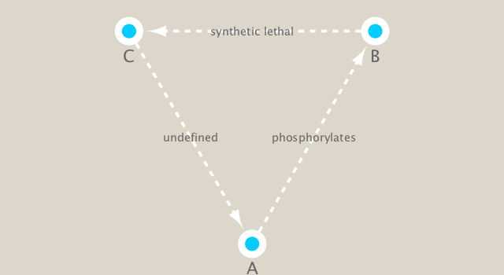

```{r setup, include=FALSE}
knitr::opts_chunk$set(echo = TRUE)
```

##Class 17

```{r}
gal <- read.csv("galExpData.csv")
head(gal)
```

#Part 2
```{r}
#install.packages("igraph")
#install.packages("RCy3")
library("igraph")
```

```{r}
source("https://bioconductor.org/biocLite.R")
biocLite("RCy3")
```

```{r}
#install.packages( c("igraph", "RColorBrewer") )
```

```{r}
library(RCy3)
library(igraph)
library(RColorBrewer)
```

Done Installing all packages
```{r}
library(RCy3)
cwd <- demoSimpleGraph()
```

Test Connection to Cytoscape
```{r}
layoutNetwork(cwd, 'force-directed')

# choose any of the other possible layouts e.g.:
possible.layout.names <- getLayoutNames(cwd)
layoutNetwork (cwd, possible.layout.names[1])

# Test the connection to Cytoscape.
ping(cwd)
```

Adjusting the display of the graphs
```{r}
setVisualStyle(cwd, "Marquee")
```

```{r}
saveImage(cwd,
          file.name="demo" ,
          image.type="png" ,
          h=350)
```

```{r}
library(knitr)

```

Other Styles available can be checked using this
```{r}
styles <- getVisualStyleNames(cwd)
styles
```

Set new Styles
```{r}
#setVisualStyle(cwd, styles[13])
#setVisualStyle(cwd, styles[18])
```

#Section 2
Read data
```{r}
## scripts for processing located in "inst/data-raw/"
prok_vir_cor <- read.delim("virus_prok_cor_abundant.tsv", stringsAsFactors = FALSE)

## Have a peak at the first 6 rows
head(prok_vir_cor)
```

We will start to use Cytoscape
```{r}
#This data is undirected so that is why we set directed = false
g <- graph.data.frame(prok_vir_cor, directed = FALSE)
```

Double Check the Graph
```{r}
class(g)
```

```{r}
g
```

```{r}
#First line of data tells us we hae 845 vertices
#UNW tell us the network connection
plot(g)
```

Let's Fix this Plot
```{r}
plot(g, vertex.size=3, vertex.label=NA)

#Functions V() and E() respectively set vertices to edges into query 
```

#Section 3
Lets Learn What the ID's are
```{r}
phage_id_affiliation <- read.delim("phage_ids_with_affiliation.tsv")
head(phage_id_affiliation)
#THese are all viruses whih is why there is a lot of missing data 
```

```{r}
bac_id_affi <- read.delim("prok_tax_from_silva.tsv")
head(bac_id_affi)
```

#Section 4  Add the taxonomic classifications to the network and then send network to Cytoscape
NA's are a problem in Cytoscape so we change NA's to not_class
```{r}
## Create our gene network 'genenet' for cytoscape
genenet.nodes <- as.data.frame(vertex.attributes(g))

## not all have classification, so create empty columns
genenet.nodes$phage_aff <- rep("not_class", nrow(genenet.nodes))
genenet.nodes$Tax_order <- rep("not_class", nrow(genenet.nodes))
genenet.nodes$Tax_subfamily <- rep("not_class", nrow(genenet.nodes))

for (row in seq_along(1:nrow(genenet.nodes))){
  if (genenet.nodes$name[row] %in% phage_id_affiliation$first_sheet.Phage_id_network){
    id_name <- as.character(genenet.nodes$name[row])
    aff_to_add <- unique(subset(phage_id_affiliation,
                                first_sheet.Phage_id_network == id_name,
                                select = c(phage_affiliation,
                                           Tax_order,
                                           Tax_subfamily)))
    genenet.nodes$phage_aff[row] <- as.character(aff_to_add$phage_affiliation)
    genenet.nodes$Tax_order[row] <- as.character(aff_to_add$Tax_order)
    genenet.nodes$Tax_subfamily[row] <- as.character(aff_to_add$Tax_subfamily)
  }
}
```

Do the same for the "proks" data
```{r}
## do the same for proks
genenet.nodes$prok_king <- rep("not_class", nrow(genenet.nodes))
genenet.nodes$prok_tax_phylum <- rep("not_class", nrow(genenet.nodes))
genenet.nodes$prok_tax_class <- rep("not_class", nrow(genenet.nodes))

for (row in seq_along(1:nrow(genenet.nodes))){
  if (genenet.nodes$name[row] %in% bac_id_affi$Accession_ID){
    aff_to_add <- unique(subset(bac_id_affi,
                                Accession_ID == as.character(genenet.nodes$name[row]),
                                select = c(Kingdom,
                                           Phylum,
                                           Class)))
    
    genenet.nodes$prok_king[row] <- as.character(aff_to_add$Kingdom)
    genenet.nodes$prok_tax_phylum[row] <- as.character(aff_to_add$Phylum)
    genenet.nodes$prok_tax_class[row] <- as.character(aff_to_add$Class)
  }
}
```

Add to the network the data related to the connections between the organisms, the edge data, and then prepare to send the nodes and edges to Cytoscape using the function cyPlot().

```{r}
genenet.edges <- data.frame(igraph::as_edgelist(g))
names(genenet.edges) <- c("name.1", "name.2")

genenet.edges$Weight <- igraph::edge_attr(g)[[1]]

genenet.edges$name.1 <- as.character(genenet.edges$name.1)
genenet.edges$name.2 <- as.character(genenet.edges$name.2)
genenet.nodes$name <- as.character(genenet.nodes$name)

ug <- cyPlot(genenet.nodes,genenet.edges)

```

Send network to Cytoscape using RCy3
```{r}
#We want to get rid of all non used graphs so that we don't overload cytoscape
cy <- CytoscapeConnection()
deleteAllWindows(cy)
```

We will make a new connection with our data
```{r}
cw <- CytoscapeWindow("Tara oceans",
                      graph = ug,
                      overwriteWindow = TRUE)
#No graph because the displaygraph function was not used
```

Now we will display our graphs on cytoscape
```{r}
displayGraph(cw)
layoutNetwork(cw)
fitContent(cw)
```

#Section 5: Cleaning up the graph in Cytoscape
We want to make each node a differnt color for each different species
```{r}
families_to_colour <- unique(genenet.nodes$prok_tax_phylum)
families_to_colour <- families_to_colour[!families_to_colour %in% "not_class"]
node.colour <- RColorBrewer::brewer.pal(length(families_to_colour), "Set3")

```

Use the colors from Rcolorbrewer to color the nodes in Cytoscape.
```{r}
setNodeColorRule(cw,
                 "prok_tax_phylum",
                 families_to_colour,
                 node.colour,
                 "lookup",
                 default.color = "#ffffff")
```

```{r}
displayGraph(cw)
layoutNetwork(cw)
fitContent(cw)
```
Set node shape to reflect virus or prokaryote
```{r}
shapes_for_nodes <- c("DIAMOND")

phage_names <- grep("ph_",
                    genenet.nodes$name,
                    value = TRUE)
setNodeShapeRule(cw,
                 "label",
                 phage_names,
                 shapes_for_nodes)
```

```{r}
displayGraph(cw)
fitContent(cw)
```

Color edges of phage nodes
```{r}
setDefaultNodeBorderWidth(cw, 5)
families_to_colour <- c(" Podoviridae",
                        " Siphoviridae",
                        " Myoviridae")
node.colour <- RColorBrewer::brewer.pal(length(families_to_colour),
                          "Dark2")
setNodeBorderColorRule(cw,
                       "Tax_subfamily",
                       families_to_colour,
                       node.colour,
                       "lookup", 
                       default.color = "#000000")
```

```{r}
displayGraph(cw)
fitContent(cw)
```

SEction 6: Setup a layout to minimize overlap of nodes
```{r}
getLayoutNames(cw)
```

```{r}
getLayoutPropertyNames(cw, layout.name="force-directed")
```

```{r}
getLayoutPropertyValue(cw, "force-directed", "defaultSpringLength") 
```

```{r}
getLayoutPropertyValue(cw, "force-directed", "numIterations") 
```

Once we have all the properties we want we can go ahead and set the settings
```{r}
#setLayoutProperties(cw,
#                    layout.name = force-directed",
#                    list(defaultSpringLength = 20,
#                         "numIterations" = 200))
#layoutNetwork(cw,
#              layout.name = "force-directed")
#fitContent(cw)
layoutNetwork(cw, layout.name = "force-directed")
fitContent(cw)
```

#Section 7. Examine network properties

We will Adjust our nodes
```{r}
## initiate a new node attribute
ug2 <- initNodeAttribute(graph = ug,
                          "degree",
                          "numeric",
                          0.0) 
```

```{r}
## degree from graph package for undirected graphs not working well,
## so instead using igraph to calculate this from the original graph
nodeData(ug2, nodes(ug2), "degree") <- igraph::degree(g)

cw2 <- CytoscapeWindow("Tara oceans with degree",
                      graph = ug2,
                      overwriteWindow = TRUE)
```

```{r}
displayGraph(cw2)
layoutNetwork(cw2)
```

Size by Degree
```{r}
#Nodes are now the sizes corresponding tot their number of connections
degree_control_points <- c(min(igraph::degree(g)),
                           mean(igraph::degree(g)),
                           max(igraph::degree(g)))
node_sizes <- c(20,
                20,
                80,
                100,
                110) # number of control points in interpolation mode,
                     # the first and the last are for sizes "below" and "above" the attribute seen.

setNodeSizeRule(cw2,
                "degree",
                degree_control_points,
                node_sizes,
                mode = "interpolate")
```

Reorganize the data to back to being the circular map pathway
```{r}
layoutNetwork(cw2,
              "force-directed")
```


